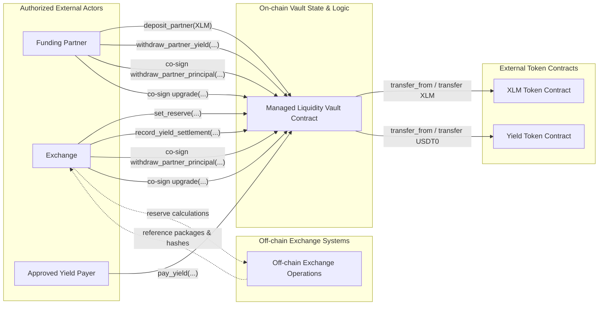

# Managed Liquidity Vault

This directory contains the Soroban smart contract for the **Managed Liquidity Vault**, a single-partner custody and settlement layer established between a **Funding Partner** and the **Exchange** (Rails).

The contract tracks two distinct assets:
1. **Principal/Collateral Asset** (`XLM`): Contributed by the funding partner to back the exchange's market-making activities.
2. **Yield/Fee Asset** (`USDT0`): Paid by the exchange as interest/yield on the reserved collateral, withdrawable only by the funding partner.

---

## Architecture & Integration Scope

The contract serves as an **auditable custody and settlement layer**. It intentionally does not implement trustless oracles, off-chain risk engines, or trading systems on-chain. Instead, it accepts authenticated inputs (such as exchange rates, reference credit levels, and settlement packages) from the configured `Exchange` and validates their mathematical consistency.



---

## Role and Authorization Matrix

The contract defines two main high-trust identities (`FundingPartner` and `Exchange`), which must be unique addresses initialized at deployment.

| Function | Authorization Requirement | Description |
| :--- | :--- | :--- |
| `__constructor` | *None* | Initializes contract state, token links, and role addresses. |
| `deposit_partner` | `FundingPartner` | Transfers `XLM` from the partner into the vault. Increases total and free principal. |
| `withdraw_partner_principal` | **Dual-Sign** (`Exchange` + `FundingPartner`) | Withdraws unreserved `XLM` principal from the vault. |
| `set_reserve` | `Exchange` | Sets the amount of `XLM` locked as collateral. Checks collateral coverage. |
| `record_yield_settlement` | `Exchange` | Records yield due for a settlement epoch and collects paid yield. |
| `pay_yield` | `from` (Caller) | Transfers `USDT0` yield tokens into the vault (open to any approved payer). |
| `withdraw_partner_yield` | `FundingPartner` | Withdraws accumulated `USDT0` yield from the vault. |
| `upgrade` | **Dual-Sign** (`Exchange` + `FundingPartner`) | Upgrades the contract's Wasm code hash. |

---

## State Model & Core Invariants

### Storage Schema (`DataKey`)
All contract state is stored in the contract instance storage (`Storage::instance`), which is regularly bumped in TTL inside `extend_contract_ttl` on every state-changing invocation:
*   `XlmToken`: Address of the principal token contract.
*   `YieldToken`: Address of the yield token contract.
*   `Exchange`: Address of the authorized exchange operator.
*   `FundingPartner`: Address of the authorized funding partner.
*   `PartnerPrincipalXlm`: Total principal contributed by the partner.
*   `FreePrincipalXlm`: Portion of principal that is unreserved and withdrawable.
*   `ReservedForExchangeXlm`: Portion of principal locked as exchange collateral.
*   `CollectedYieldUsdt0`: Yield tokens paid in and available for withdrawal.
*   `YieldDebtUsdt0`: Yield obligation recorded but not yet paid.
*   `LatestSettlementEpoch`: ID of the most recently settled epoch.
*   `LastSetReserveExchangeRate` / `LastSetReserveCredit`: Last audited exchange rate and off-chain credit level.
*   `LastReserveReferenceHash` / `LastYieldSettlementReferenceHash`: Optional 32-byte hash link to off-chain audit packages.

### Enforced Invariants
1.  **Principal Balance Conservation**:
    $$\text{FreePrincipalXlm} + \text{ReservedForExchangeXlm} = \text{PartnerPrincipalXlm}$$
2.  **Yield Collection Backing**:
    `CollectedYieldUsdt0` only increases when `USDT0` is successfully transferred into the contract. Unpaid obligations remain in `YieldDebtUsdt0`.
3.  **Monotonic Epochs**:
    `epoch_id` must strictly increase in `record_yield_settlement`.
4.  **Collateral Coverage constraint**:
    If `reference_credit_usdt0 > 0`, then:
    $$\frac{\text{target\\_reserved\\_xlm} \times \text{exchange\\_rate}}{\text{RATE\\_SCALE}} \ge \text{reference\\_credit\\_usdt0}$$
    *(Where $\text{RATE\\_SCALE} = 10,000,000$)*

---

## Security Audit & Threat Model Highlights (STRIDE)

A STRIDE threat analysis is maintained in [stride-threat-model.md](./src/stride-threat-model.md). Key security design decisions include:

*   **Authentication & Gating**: Every state-changing function requires explicit `.require_auth()` verification of the actor. The upgrade method and principal withdrawals require a joint multi-sig pattern where both parties must submit authorization.
*   **Off-chain Input Tampering**: The contract does not verify the accuracy of the exchange rate or credit level. Off-chain reconciliation workflows must monitor `set_reserve` and `record_yield_settlement` events against trusted internal risk engine logs using the `reference_hash`.
*   **Liveness Dependency**: If either the `Exchange` or `FundingPartner` key is lost or compromised, principal withdrawals and code upgrades are blocked. Strong multi-sig custody models must be implemented off-chain for both keys.
*   **Instance Expiry (TTL)**: To prevent contract entries or Wasm bytecode from expiring due to low activity, `extend_contract_ttl` bumps instance TTL to $\sim 30$ days whenever state changes.

---

## Verification & Testing

### Formal Verification (Certora)
The codebase includes formal specification rules for the Certora Prover under the `certora` feature flag. The rules are located in [spec.rs](./src/certora/spec.rs) and cover validation of boundary cases, rejection of negative amounts, and authorization constraints.

To compile the contract with Certora instrumentation:
```bash
cargo build --target wasm32-unknown-unknown --release --features certora
```

### Unit Tests
A comprehensive test suite simulating deposits, withdrawals, reserve changes, and multi-sig operations is implemented in [test.rs](./src/test.rs).

To run the Rust unit tests:
```bash
cargo test
```
