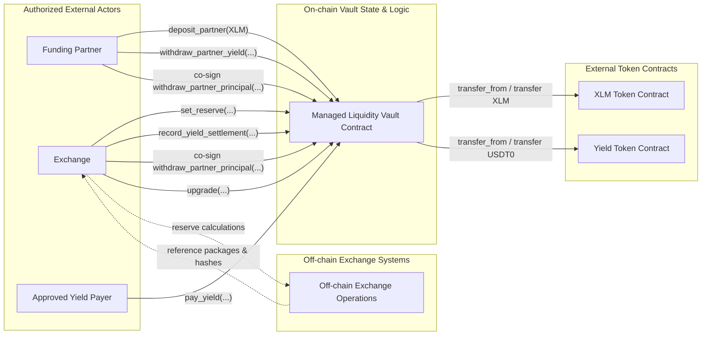

# Managed Liquidity Vault

This directory contains the Soroban smart contract for the **Managed Liquidity Vault**, a single-partner custody and settlement layer established between a **Funding Partner** and the **Exchange** (Rails).

The contract tracks two distinct assets:

1. **Principal/Collateral Asset** (`XLM`): Contributed by the funding partner to back the exchange's market-making activities.
2. **Yield/Fee Asset** (`USDT0`): Paid by the exchange as interest/yield on the reserved collateral, withdrawable only by the funding partner.

---

## Architecture & Integration Scope

The contract serves as an **auditable custody and settlement layer**. It intentionally does not implement trustless oracles, off-chain risk engines, or trading systems on-chain. Instead, it accepts authenticated inputs (such as exchange rates, reference credit levels, and settlement packages) from the configured `Exchange` and validates their mathematical consistency.



---

## Role and Authorization Matrix

The contract defines two main high-trust identities (`FundingPartner` and `Exchange`), which must be unique addresses initialized at deployment.

| Function                     | Authorization Requirement                     | Description                                                                          |
| :--------------------------- | :-------------------------------------------- | :----------------------------------------------------------------------------------- |
| `__constructor`              | _None_                                        | Initializes contract state, token links, and role addresses.                         |
| `deposit_partner`            | `FundingPartner`                              | Transfers `XLM` from the partner into the vault. Increases total and free principal. |
| `withdraw_partner_principal` | **Dual-Sign** (`Exchange` + `FundingPartner`) | Withdraws unreserved `XLM` principal from the vault.                                 |
| `set_reserve`                | `Exchange`                                    | Sets the amount of `XLM` locked as collateral. Checks collateral coverage.           |
| `record_yield_settlement`    | `Exchange`                                    | Records yield due for a settlement epoch and collects paid yield.                    |
| `pay_yield`                  | `from` (Caller)                               | Transfers `USDT0` yield tokens into the vault (open to any approved payer).          |
| `withdraw_partner_yield`     | `FundingPartner`                              | Withdraws accumulated `USDT0` yield from the vault.                                  |
| `recover_unaccounted_tokens` | `Exchange`                                    | Recovers token balances that the vault ledger does not account for.                  |
| `upgrade`                    | `Exchange`                                    | Upgrades the contract's Wasm code hash. The funding partner does **not** co-sign.    |

### Upgrade Authority and Permissionless Yield Payment

Two authorization behaviours are easy to misread from earlier design drafts, so
they are stated explicitly here.

**Upgrades are authorized by the `Exchange` alone.** An earlier design revision
placed upgrades behind a dedicated governance `Owner` address, jointly
controlled by both parties. That separation was dropped before implementation:
`UpgradeableInternal::_require_auth` requires the configured `Exchange` and
rejects every other operator, and the contract has no `Owner` role. This is a
deliberate centralization — an upgrade can rewrite any authorization or
accounting rule, so the `Exchange` effectively holds ultimate control. The
residual risk is accepted and bounded off-chain by the business partnership
contract and by upgrade review procedures, not by on-chain dual control
(`Spoof.3`, `Elevation.1` in the STRIDE model).

**`pay_yield` is intentionally permissionless.** It authorizes the `from`
address and nothing else, so any self-authorizing address — an alternate fee or
treasury wallet, not just the `Exchange` — can pay yield in. This is safe
because the method can only move value into the vault: it reduces
`YieldDebtUsdt0` (floored at zero) and increases `CollectedYieldUsdt0`, both of
which can only improve the funding partner's position. Integrators must not
treat the payer identity as an authorization signal; use the `YieldPaidEvt`
event stream and off-chain records to attribute payments.

### Why Principal Withdrawal Stays Dual-Signed

`withdraw_partner_principal` is limited to `FreePrincipalXlm`, so it can never
touch collateral the `Exchange` has reserved. That makes a partner-only
withdrawal look safe on-chain, but the dual signature is retained deliberately:

- **`set_reserve` is a periodic posting, not a live measurement.** The reserved
  amount reflects off-chain credit as of the last exchange submission. Between
  submissions, real exposure can move — through XLM price moves against the
  reserved collateral or through intra-epoch credit drawdown — so principal that
  is "free" against the last posting is not necessarily free against current
  exposure. The co-sign gives the `Exchange` the opportunity to post an updated
  reserve before principal leaves, instead of discovering the shortfall after.
- **Outstanding yield debt is not collateralized.** The partner can hold
  unpaid `YieldDebtUsdt0` while withdrawing principal; requiring both signatures
  keeps the wind-down of the position a joint action rather than a unilateral
  one.
- **The vault mirrors a bilateral agreement.** Both parties co-signing each
  principal movement is the on-chain expression of the off-chain contract and
  gives each side non-repudiable evidence of the other's approval
  (`Repudiate.2` in the STRIDE model).

The accepted cost is a shared liveness dependency: if either key is unavailable,
principal withdrawal is blocked. This is tracked as `DoS.1` / `DoS.2` in the
STRIDE model and is handled through resilient custody and signing procedures on
both sides.

### Constructor Validation

The role and token addresses are immutable after deployment, so the constructor
rejects any configuration that would produce an unusable or unsound vault:

- `xlm_token` and `yield_token` must differ, and `exchange` and
  `funding_partner` must differ.
- Neither role address may be one of the two token contracts.
- Both token addresses are probed through the SEP-41 `decimals` entrypoint.
  An address that is not a live contract implementing the token interface makes
  deployment fail, instead of yielding a vault whose transfers can never
  succeed.
- Both tokens must report the **same decimal precision**. The collateral
  coverage check cancels `RATE_SCALE` but does not normalize token precision, so
  it is only correct when the principal and yield tokens share the same number
  of decimals. Pinning this at construction turns a pre-deployment review item
  into an enforced on-chain constraint. The intended deployment uses XLM (7
  decimals) and a 7-decimal `USDT0` issuance on Stellar; a 6-decimal `USDT0`
  would be rejected at deployment rather than silently mis-priced.

### Recovery of Unaccounted Tokens

The vault holds real token balances, but only moves them through the principal
and yield flows it tracks. Two situations leave value stranded:

1. A third-party token is sent to the vault address. The vault has no ledger
   entry for it and no other entrypoint can move it.
2. The configured principal or yield token is transferred to the vault directly,
   bypassing `deposit_partner`, `pay_yield`, or `record_yield_settlement`. The
   real balance grows but `PartnerPrincipalXlm` / `CollectedYieldUsdt0` do not,
   so the surplus sits above what any withdrawal can reach.

`recover_unaccounted_tokens(token, to, amount)` recovers both cases. (The audit
refers to this as a sweep path; the entrypoint is named after the finding's
recommendation of a "carefully-authorized recovery path".) The recoverable
amount is reported by the `unaccounted_balance(token)` view:

- For the configured principal token: `balance − PartnerPrincipalXlm`.
- For the configured yield token: `balance − CollectedYieldUsdt0`.
- For any other token: the full balance.

The surplus is floored at zero, so tracked principal and collected yield can
never leave through this path — recovery cannot be used to drain partner funds
or to bypass the dual-signed principal withdrawal. Recovery is authorized by the
`Exchange` alone and emits `UnaccountedTokensRecoveredEvt`; returning recovered
funds to their rightful owner is an off-chain operational responsibility of the
`Exchange`.

---

## State Model & Core Invariants

### Storage Schema (`DataKey`)

All contract state is stored in the contract instance storage (`Storage::instance`), which is regularly bumped in TTL inside `extend_contract_ttl` on every state-changing invocation:

- `XlmToken`: Address of the principal token contract.
- `YieldToken`: Address of the yield token contract.
- `Exchange`: Address of the authorized exchange operator.
- `FundingPartner`: Address of the authorized funding partner.
- `PartnerPrincipalXlm`: Total principal contributed by the partner.
- `FreePrincipalXlm`: Portion of principal that is unreserved and withdrawable.
- `ReservedForExchangeXlm`: Portion of principal locked as exchange collateral.
- `CollectedYieldUsdt0`: Yield tokens paid in and available for withdrawal.
- `YieldDebtUsdt0`: Yield obligation recorded but not yet paid.
- `TotalExcessYieldPaidUsdt0`: Running total of yield paid beyond the debt that was
  outstanding at the time of payment (accounting metadata only).
- `LatestSettlementEpoch`: ID of the most recently settled epoch.
- `LastSetReserveExchangeRate` / `LastSetReserveCredit`: Last audited exchange rate and off-chain credit level.
- `LastReserveReferenceHash` / `LastYieldSettlementReferenceHash`: Optional 32-byte hash link to off-chain audit packages.

### Enforced Invariants

1.  **Principal Balance Conservation**:
    $$\text{FreePrincipalXlm} + \text{ReservedForExchangeXlm} = \text{PartnerPrincipalXlm}$$
2.  **Yield Collection Backing**:
    `CollectedYieldUsdt0` only increases when `USDT0` is successfully transferred into the contract. Unpaid obligations remain in `YieldDebtUsdt0`.
3.  **Excess Payment Traceability**:
    A `pay_yield` payment larger than the outstanding `YieldDebtUsdt0` clears the
    debt, credits the full amount to `CollectedYieldUsdt0`, and records the
    surplus in both `TotalExcessYieldPaidUsdt0` and the `excess` field of
    `YieldPaidEvt`. The surplus is reconciliation metadata: it is **not** netted
    against the due amount of a later settlement epoch, so
    `record_yield_settlement` still books each epoch's obligation in full.
    Off-chain settlement remains the place where an overpayment is applied to a
    future period, and `total_excess_yield_paid_usdt0()` exposes the running total for
    that reconciliation.
4.  **Monotonic Epochs**:
    `epoch_id` must strictly increase in `record_yield_settlement`.
5.  **Collateral Coverage constraint**:
    If `reference_credit_usdt0 > 0`, then:
    $$\frac{\text{target\\_reserved\\_xlm} \times \text{exchange\\_rate}}{\text{RATE\\_SCALE}} \ge \text{reference\\_credit\\_usdt0}$$
    Where $\text{RATE\\_SCALE} = 10,000,000$

---

## Security Audit & Threat Model Highlights (STRIDE)

A STRIDE threat analysis is maintained in [stride-threat-model.md](./src/stride-threat-model.md). Key security design decisions include:

- **Authentication & Gating**: Every state-changing function requires explicit `.require_auth()` verification of the actor. Principal withdrawal requires a joint multi-sig pattern where both parties must submit authorization; contract upgrades require the `Exchange` alone.
- **Off-chain Input Tampering**: The contract does not verify the accuracy of the exchange rate or credit level. Off-chain reconciliation workflows must monitor `set_reserve` and `record_yield_settlement` events against trusted internal risk engine logs using the `reference_hash`.
- **Liveness Dependency**: If either the `Exchange` or `FundingPartner` key is lost or compromised, principal withdrawals are blocked. Code upgrades depend on the `Exchange` key alone. Strong multi-sig custody models must be implemented off-chain for both keys.
- **Instance Expiry (TTL)**: To prevent contract entries or Wasm bytecode from expiring due to low activity, `extend_contract_ttl` bumps instance TTL to $\sim 30$ days whenever state changes.

---

## Verification & Testing

### Formal Verification (Certora)

The codebase includes formal specification rules for the Certora Prover under the `certora` feature flag. The rules are located in [spec.rs](./src/certora/spec.rs) and cover validation of boundary cases, rejection of negative amounts, and authorization constraints.

To compile the contract with Certora instrumentation:

```bash
cargo build --target wasm32-unknown-unknown --release --features certora
```

### Unit Tests

A comprehensive test suite simulating deposits, withdrawals, reserve changes, and multi-sig operations is implemented in [test.rs](./src/test.rs).

To run the Rust unit tests:

```bash
cargo test
```
