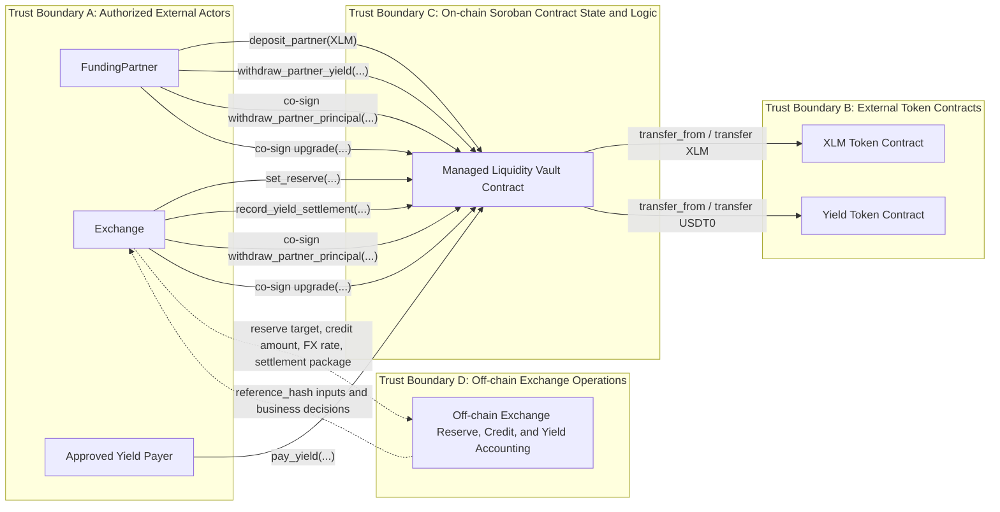

# STRIDE Threat Model: Managed Liquidity Vault

## What are we working on?

The project under review is the Soroban managed liquidity vault implemented in [contract.rs](./contract.rs). The contract is a single-partner, single-exchange vault with two privileged operating roles:

- `FundingPartner`
  - deposits `XLM` principal into the vault,
  - withdraws collected `USDT0` yield,
  - co-signs principal withdrawals,
  - co-signs upgrades.
- `Exchange`
  - sets the reserved `XLM` collateral target,
  - records yield settlement epochs,
  - may pay yield directly or through another payer,
  - co-signs principal withdrawals,
  - co-signs upgrades.

The contract holds two assets and tracks them separately:

- `XLM` principal held by the vault and split between `FreePrincipalXlm` and `ReservedForExchangeXlm`.
- `USDT0`-like yield tokens held by the vault and split between `CollectedYieldUsdt0` and `YieldDebtUsdt0`.

The contract intentionally does not model or verify the exchange's internal trading engine, market making positions, reserve valuation source, or settlement economics on-chain. Instead, it records the on-chain custody state and accepts authenticated reserve and settlement inputs from the configured `Exchange`. This makes the contract an auditable settlement and custody layer, not a trustless risk engine.

The public contract surface analyzed in this threat model is:

- `__constructor`
- `deposit_partner`
- `withdraw_partner_principal`
- `set_reserve`
- `record_yield_settlement`
- `pay_yield`
- `withdraw_partner_yield`
- `UpgradeableInternal`

### Data flow diagram

### Protected assets

- `XLM` principal balance held by the vault contract.
- `USDT0` yield balance held by the vault contract.
- Correctness of `PartnerPrincipalXlm`, `FreePrincipalXlm`, and `ReservedForExchangeXlm`.
- Correctness of `CollectedYieldUsdt0`, `YieldDebtUsdt0`, and `LatestSettlementEpoch`.
- Integrity of audit metadata:
  - `LastSetReserveExchangeRate`
  - `LastSetReserveCredit`
  - `LastReserveReferenceHash`
  - `LastYieldSettlementReferenceHash`
- Integrity of configured role addresses:
  - `Exchange`
  - `FundingPartner`
- Availability of partner withdrawals, exchange reserve updates, and yield settlement flows.
- Integrity of upgrade authority and deployed contract code.

### Trust boundaries and assumptions

- The Soroban contract enforces authentication, balance accounting, monotonic epoch progression, and a minimum collateral coverage check based on the values supplied to `set_reserve`.
- The contract does not independently verify whether the supplied `reference_credit_usdt0`, `exchange_rate`, `yield_due_usdt0`, or `reference_hash` reflect truthful off-chain business state.
- The token contracts are external dependencies. The vault assumes the configured `XLM` and yield token contracts behave correctly and cannot be replaced after initialization.
- The `Exchange` and `FundingPartner` keys are high-trust identities. Compromise of either changes the threat profile materially.
- The `Exchange` and `FundingPartner` keys are held by separate parties. This separation is part of the deployment trust model behind the dual-sign principal withdrawal design.

## What can go wrong?

### STRIDE reminders

| Mnemonic | Threat                 | Definition                                                                                                   | Question                                                                                                                     |
| -------- | ---------------------- | ------------------------------------------------------------------------------------------------------------ | ---------------------------------------------------------------------------------------------------------------------------- |
| S        | Spoofing               | The ability to impersonate another user or system component to gain unauthorized access.                     | Is the user who they say they are?                                                                                           |
| T        | Tampering              | Unauthorized alteration of data or code.                                                                     | Has the data or code been modified in some way?                                                                              |
| R        | Repudiation            | The ability for a system or user to deny having taken a certain action.                                      | Is there enough data to prove the user took the action if they were to deny it?                                              |
| I        | Information Disclosure | The over-sharing of data expected to be kept private.                                                        | Is there anywhere where excessive data is being shared or controls are not properly in place to protect private information? |
| D        | Denial of Service      | The ability for an attacker to negatively affect the availability of a system.                               | Can someone, without authorization, impact the availability of the service or business?                                      |
| E        | Elevation of Privilege | The ability for an attacker to gain additional privileges and roles beyond what they initially were granted. | Are there ways for a user, without proper authentication and authorization to gain access to additional privileges?          |

### Threat table

| Threat                 | Issues                                                                                                                                                                                                                                                                                                                                                                                                                                                                                                                                                                                                                                                                                                                                                                                                                                            |
| ---------------------- | ------------------------------------------------------------------------------------------------------------------------------------------------------------------------------------------------------------------------------------------------------------------------------------------------------------------------------------------------------------------------------------------------------------------------------------------------------------------------------------------------------------------------------------------------------------------------------------------------------------------------------------------------------------------------------------------------------------------------------------------------------------------------------------------------------------------------------------------------- |
| Spoofing               | `Spoof.1` - An attacker who compromises the configured `FundingPartner` key can call `deposit_partner` or `withdraw_partner_yield` as the partner and move economic value under a legitimate identity.  `Spoof.2` - An attacker who compromises the configured `Exchange` key can call `set_reserve` and `record_yield_settlement` with apparently valid authority, even if the off-chain reserve or settlement package is false.  `Spoof.3` - An attacker who compromises both the `Exchange` and `FundingPartner` keys can authenticate an upgrade and replace contract code while appearing to be legitimate governance.  `Spoof.4` - An attacker posing as an approved external payer can call `pay_yield` and create confusing settlement or reconciliation noise if off-chain systems treat payer identity as meaningful. |
| Tampering              | `Tamper.1` - The `Exchange` can submit a manipulated `reference_credit_usdt0` or `exchange_rate` to `set_reserve`, making the reserve check pass against false off-chain inputs and understating real collateral risk.  `Tamper.2` - The `Exchange` can submit manipulated `yield_due_usdt0`, `yield_paid_usdt0`, `epoch_id`, or `reference_hash` values in `record_yield_settlement`, corrupting the on-chain representation of obligations even though token transfer checks still apply.  `Tamper.3` - A malicious or faulty token contract could return unexpected behavior during `transfer` or `balance`, undermining vault accounting assumptions or availability.  `Tamper.4` - A malicious upgrade could alter auth checks, accounting invariants, or withdrawal rules after deployment.                               |
| Repudiation            | `Repudiate.1` - The `Exchange` may later dispute having submitted a reserve target, collateral ratio, or settlement package if off-chain approval records are weak and only on-chain events exist.  `Repudiate.2` - The `FundingPartner` or `Exchange` may dispute having approved a principal withdrawal if they do not retain matching off-chain approval context for a dual-signed transaction.  `Repudiate.3` - A payer may dispute the business reason for a `pay_yield` transfer because the function records amount but not purpose, settlement epoch, or payer-side justification.                                                                                                                                                                                                                                            |
| Information Disclosure | `Info.1` - `set_reserve` publishes `reference_credit_usdt0`, `exchange_rate`, and optional `reference_hash`, which may expose commercially sensitive information about internal credit utilization or reconciliation cadence.  `Info.2` - `record_yield_settlement` publishes settlement timing, due amounts, and optional references, which may reveal yield obligations or payment delays to outside observers.  `Info.3` - Read methods expose current reserve, debt, and balance state to any observer, allowing competitors or counterparties to infer business health or operational stress.                                                                                                                                                                                                                                    |
| Denial of Service      | `DoS.1` - If the `Exchange` becomes unavailable, maliciously refuses to sign, or loses its key, `withdraw_partner_principal` and `upgrade` become unavailable because they require both `Exchange` and `FundingPartner` authorization.  `DoS.2` - If the `FundingPartner` becomes unavailable or loses its key, yield withdrawals, principal withdrawals, and upgrades become unavailable.  `DoS.3` - If either external token contract is paused, broken, blacklisted, or otherwise non-functional, deposits, withdrawals, or yield payments may fail even when vault logic is correct.  `DoS.4` - Repeated malicious or accidental under-collateralized `set_reserve` attempts can block timely reserve updates until the operator submits corrected values, creating operational friction during fast market movement.       |
| Elevation of Privilege | `Elevation.1` - Combining control of both `Exchange` and `FundingPartner` keys gives full control over principal withdrawals, upgrades, and most operational flows, exceeding the intended separation of duties.  `Elevation.2` - Reusing the same real-world custodian, signer set, or infrastructure for `Exchange` and `FundingPartner` can collapse role separation and create an unintended privilege escalation path without any on-chain bug.  `Elevation.3` - A malicious upgrade can introduce new privileged methods or weaken existing authorization checks, creating privilege elevation after deployment.                                                                                                                                                                                                                |

## What are we going to do about it?

| Threat                 | Issues                                                                                                                                                                                                                                                                                                                                                                                                                                                                                                                                                                                                                                                                                                                                                                                                                                                                                                                                                                                                                                                                                                                                                                                                                                                                                                                                                                                                                                                                                                                                                                                                                                                                                                                                                                                                                                                                                                                            |
| ---------------------- | --------------------------------------------------------------------------------------------------------------------------------------------------------------------------------------------------------------------------------------------------------------------------------------------------------------------------------------------------------------------------------------------------------------------------------------------------------------------------------------------------------------------------------------------------------------------------------------------------------------------------------------------------------------------------------------------------------------------------------------------------------------------------------------------------------------------------------------------------------------------------------------------------------------------------------------------------------------------------------------------------------------------------------------------------------------------------------------------------------------------------------------------------------------------------------------------------------------------------------------------------------------------------------------------------------------------------------------------------------------------------------------------------------------------------------------------------------------------------------------------------------------------------------------------------------------------------------------------------------------------------------------------------------------------------------------------------------------------------------------------------------------------------------------------------------------------------------------------------------------------------------------------------------------------------------- |
| Spoofing               | `Spoof.1.R.1` - Current code requires `FundingPartner.require_auth()` for `deposit_partner` and `withdraw_partner_yield`, so unauthorized callers cannot exercise these flows without the partner key.  `Spoof.1.R.2` - We will keep the `FundingPartner` key in strong custody with incident response procedures for compromise, including freezing off-chain business activity and rotating to a new contract if needed.  `Spoof.2.R.1` - Current code requires `Exchange.require_auth()` for `set_reserve` and `record_yield_settlement`, so only the configured exchange identity can submit reserve and settlement state.  `Spoof.2.R.2` - We will enforce off-chain dual control, approval policy, and monitoring around all exchange-originated reserve and settlement submissions, because the contract does not validate the truth of the business inputs.  `Spoof.2.R.3` - We will reconcile all `set_reserve` and `record_yield_settlement` calls against signed internal records and `reference_hash` artifacts retained outside the chain.  `Spoof.3.R.1` - Current code requires both `Exchange` and `FundingPartner` auth inside `UpgradeableInternal::_require_auth`, and rejects any operator that is neither of those configured roles.  `Spoof.3.R.2` - We will require explicit upgrade review and auditable approval before any production upgrade is signed and submitted.  `Spoof.4.R.1` - Current code requires `from.require_auth()` in `pay_yield`, so the payer identity on-chain is genuine for the submitted address.  `Spoof.4.R.2` - If payer identity matters operationally, we will maintain an allowlist or off-chain ledger linking payer addresses to approved business entities and settlement reasons.                                                                                                                                      |
| Tampering              | `Tamper.1.R.1` - Current code enforces `target_reserved_xlm >= 0`, non-negative audit values, `target_reserved_xlm <= PartnerPrincipalXlm`, and a minimum coverage check `target_reserved_xlm * exchange_rate / RATE_SCALE >= reference_credit_usdt0`.  `Tamper.1.R.2` - Residual risk: these checks only validate arithmetic consistency of the submitted numbers, not whether the numbers accurately describe real off-chain exposure.  `Tamper.1.R.3` - We will require independent off-chain reconciliation of `reference_credit_usdt0` and `exchange_rate` against risk engine outputs, approved pricing sources, and signed reserve packages.  `Tamper.2.R.1` - Current code enforces non-negative settlement values, strictly increasing `epoch_id`, and prevents `yield_paid_usdt0` from exceeding prior debt plus current due.  `Tamper.2.R.2` - Current code only increases `CollectedYieldUsdt0` after an actual token transfer for `yield_paid_usdt0`, limiting purely notional overstatement of collected yield.  `Tamper.2.R.3` - We will require each settlement epoch to map to a retained off-chain package whose hash is stored in `reference_hash`, and we will alert on missing or blank references where policy expects them.  `Tamper.3.R.1` - Current code treats token transfers as external dependencies and does not defend against a malicious token implementation.  `Tamper.3.R.2` - We will deploy only against vetted token contracts, pin those addresses at construction time, and include token-contract review in the audit scope.  `Tamper.4.R.1` - Current code restricts upgrades to the joint `Exchange` plus `FundingPartner` signer set.  `Tamper.4.R.2` - We will require reviewed WASM hashes, change management approvals, and post-upgrade verification of auth and accounting invariants before re-enabling production usage. |
| Repudiation            | `Repudiate.1.R.1` - Current code emits `ReserveSetEvt` and `YieldSettlementEvt` with the submitted values, creating an immutable on-chain record of the authenticated action.  `Repudiate.1.R.2` - We will preserve off-chain approval tickets, operator identities, and the referenced reserve or settlement artifacts so the organization can prove who authorized the submission and why.  `Repudiate.2.R.1` - Current code requires both `Exchange` and `FundingPartner` to authorize `withdraw_partner_principal`, and emits `PartnerPrincipalOutEvt` after transfer.  `Repudiate.2.R.2` - We will retain withdrawal approval workflow records, beneficiary justification, and transaction review logs off-chain because the contract does not store human-readable withdrawal purpose.  `Repudiate.3.R.1` - Current code emits `YieldPaidEvt` for direct payments and records yield-balance changes on-chain.  `Repudiate.3.R.2` - We will match each `pay_yield` transfer to off-chain settlement identifiers or treasury accounting entries because the function itself does not bind the payment to a specific epoch or liability reason.                                                                                                                                                                                                                                                                                                                                                                                                                                                                                                                                                                                                                                                                                                                                                  |
| Information Disclosure | `Info.1.R.1` - Residual risk: reserve credit, exchange rate, and reference metadata are intentionally stored on-chain for auditability, so they are visible to all observers.  `Info.1.R.2` - We will avoid embedding sensitive plaintext business data in `reference_hash`; we will use opaque hashes or identifiers that require access to private internal systems to interpret.  `Info.1.R.3` - We will confirm internally that publication of credit and reserve metrics is an accepted business disclosure before production use.  `Info.2.R.1` - Residual risk: settlement timing and yield obligation data are visible through events and read methods because auditability was prioritized over confidentiality.  `Info.2.R.2` - We will keep detailed settlement support data off-chain and publish only the minimum values required for contract operation and audit readiness.  `Info.3.R.1` - Residual risk: public state visibility is inherent to the chain environment and cannot be removed without redesigning the product model.  `Info.3.R.2` - We will treat reserve levels, debt levels, and payout timing as public or inferable information in partner agreements and business planning.                                                                                                                                                                                                                                                                                                                                                                                                                                                                                                                                                                                                                                                                              |
| Denial of Service      | `DoS.1.R.1` - Current code intentionally requires both `Exchange` and `FundingPartner` authorization for principal withdrawal and upgrade, which protects against unilateral action but creates shared liveness dependency.  `DoS.1.R.2` - We will maintain resilient exchange signing operations, backup operators, documented signing SLAs, and emergency procedures for signing-system or workflow outages that could block approvals.  `DoS.2.R.1` - Current code intentionally binds yield withdrawal to `FundingPartner` auth and binds upgrade to the same partner plus the exchange, creating a hard dependency on partner liveness.  `DoS.2.R.2` - We will require the `FundingPartner` to use resilient custody and define replacement or migration procedures if its signer set becomes unavailable.  `DoS.3.R.1` - We will audit and operationally monitor the configured token contracts and avoid assets with pause, blacklist, or admin features that can unexpectedly block vault flows unless that risk is explicitly accepted.  `DoS.4.R.1` - Current code rejects under-collateralized reserve submissions rather than accepting unsafe state.  `DoS.4.R.2` - We will maintain operational alerts and reserve headroom targets so exchange staff can update reserve settings quickly during market moves without repeatedly hitting validation failures.                                                                                                                                                                                                                                                                                                                                                                                                                                                                                                                   |
| Elevation of Privilege | `Elevation.1.R.1` - Current code requires both `Exchange` and `FundingPartner` to authorize upgrades, removing single-key owner escalation but concentrating governance in the two operating roles.  `Elevation.1.R.2` - Accepted deployment assumption: `Exchange` and `FundingPartner` keys are held by separate parties, which preserves the intended separation of duties for principal withdrawal and upgrade.  `Elevation.2.R.1` - Residual risk: compromise or collusion across both parties still defeats the main withdrawal and upgrade control model.  `Elevation.2.R.2` - We will document and periodically review the real-world ownership, custody providers, signer overlap, and infrastructure overlap behind both privileged roles to prevent hidden privilege collapse.  `Elevation.3.R.1` - We will treat all upgrades as a full re-review trigger for the threat model, authorization matrix, and audit assumptions before deployment.                                                                                                                                                                                                                                                                                                                                                                                                                                                                                                                                                                                                                                                                                                                                                                                                                                                                                                                                                |

## Did we do a good job?

- Has the data flow diagram been referenced since it was created?
  - Yes. It is directly useful for locating the trust boundary between on-chain enforcement and off-chain reserve and settlement assertions, which is the core security property of this contract.
- Did the STRIDE model uncover any new design issues or concerns that had not been previously addressed or thought of?
  - Yes. The main concern is not a missing auth check in the current implementation, but the concentration of trust in off-chain exchange submissions and the operational importance of governance and signer separation.
  - The model also highlights that public audit metadata may reveal commercially sensitive business information and that this disclosure is a product decision, not just a technical detail.
- Did the treatments identified in the “What are we going to do about it” section adequately address the issues identified?
  - Partially in code and partially through process.
  - The current contract already enforces the most important on-chain controls: role gating, dual-sign principal withdrawal, monotonic settlement epochs, non-negative accounting, and minimum collateral coverage checks against submitted values.
  - The remaining high-severity risks are largely operational and governance risks that must be handled through governance controls, reconciliation, monitoring, and controlled upgrades.
- Have additional issues been found after the threat model?
  - The current analysis suggests follow-up review is warranted whenever any of the following change:
    - privileged role addresses,
    - upgrade process,
    - token contract choices,
    - reserve or settlement operating procedures,
    - data included in `reference_hash` workflows.
- Any additional thoughts or insights on the threat modeling process that could help improve it next time?
  - Future revisions should include the exact off-chain reserve calculation workflow, approval chain, and settlement artifact lifecycle if those systems are in audit scope.
  - If the product evolves to support role rotation, emergency pause logic, or stronger attestation of off-chain accounting, the threat model should be updated before requesting a new audit.
