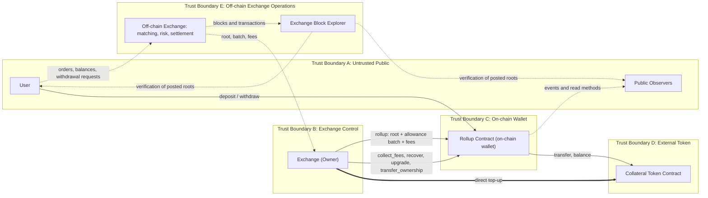

# STRIDE Threat Model: Rollup Contract

## What are we working on?

The contract in [contract.rs](./contract.rs) is an on-chain wallet for a centralized exchange. Its purpose is to make the exchange's funds visible to users.

The exchange runs matching, risk, liquidation, settlement, and accounting off-chain. The contract holds the collateral, publishes a commitment to each settlement batch, and lets a user withdraw the allowance the exchange credited to them. It shares this shape with the sibling managed liquidity vault: funds on-chain, operations off-chain.

| Role                     | Can do                                                                                                    |
| :----------------------- | :--------------------------------------------------------------------------------------------------------- |
| `Owner` (the exchange)   | `rollup`, `collect_fees`, `recover`, `upgrade`, `transfer_ownership`; top up the wallet by direct transfer |
| `User` (any address)     | `deposit`, `withdraw` their own credited allowance                                                        |

### Design position

1. **The exchange has full control, by design.** This is the exchange's wallet. The exchange decides what settles, who is credited, and where its own funds go. How it credits customers internally and which address receives its fees are business decisions, outside the scope of this model.
2. **Transparency is the product.** `new_block_hash` is an opaque commitment to a settlement batch, called the root below, and the contract stores and orders it. The exchange publishes the blocks and transactions behind every root on its own public explorer, so an observer can recompute a root and check it against what was committed.
3. **Solvency is out of scope.** Customer liabilities live off-chain. The `InsufficientBalance` check in `rollup` is an over-crediting guard that keeps new credits within the unreserved balance.

### What the contract guarantees

`TotalWithdrawable` reserves every credited allowance plus accrued fees, and the reservation is structurally enforced: collateral leaves only through `withdraw` and `collect_fees`, and both decrement it. `recover` refuses the collateral token. An allowance, once credited, stays covered. Two paths bypass this: an upgrade, which replaces the enforcing code (`Tamper.4`), and a collateral asset reachable through a second contract address, which `recover` treats as unrelated (`Tamper.5`).

### Data flow diagram

### Protected assets

- The collateral held in the wallet, and the coverage of every credited allowance.
- Integrity of `LatestBlockHash`, `TotalWithdrawable`, `Fees`, and each `WithdrawalAllowances(Address)`.
- Integrity of the `Owner` address, the pending-owner entry, and the deployed Wasm.
- Availability of user withdrawals and of exchange settlement.
- Integrity, durability, and availability of the explorer, which carries the transparency property.

### Trust assumptions

- The contract authenticates callers, checks arithmetic, enforces batch consistency, orders settlements by compare-and-swap on `old_block_hash`, and applies the over-crediting guard. These checks cover the form of each submission; its correctness is established off-chain.
- The `Owner` key is the only control over the wallet's funds. Its custody is the primary security measure in this design.
- The collateral token is pinned at construction and assumed to transfer exact amounts, report balances truthfully, and hold funds without freeze or clawback.
- Direct transfers into the wallet are normal exchange operation.
- Soroban rolls back all state on an error return, so the allowance writes in `rollup` persist only when every later check in the same call passes.

## What can go wrong?

### STRIDE reminders

| Mnemonic | Threat                 | Question                                                                        |
| -------- | ---------------------- | --------------------------------------------------------------------------------- |
| S        | Spoofing               | Is the user who they say they are?                                              |
| T        | Tampering              | Has the data or code been modified in some way?                                 |
| R        | Repudiation            | Is there enough data to prove the user took the action if they were to deny it? |
| I        | Information Disclosure | Is private data over-shared, or shared with more people than necessary?         |
| D        | Denial of Service      | Can someone, without authorization, impact availability?                        |
| E        | Elevation of Privilege | Can someone gain privileges without proper authentication and authorization?    |

### Threat table

| Threat                 | Issues |
| ---------------------- | ------ |
| Spoofing               | `Spoof.1` - An attacker holding the `Owner` key is the exchange as far as the chain is concerned. It can credit allowances to itself and withdraw the unreserved balance, collect fees, and upgrade the code to take the rest. Key custody is the only control.  `Spoof.2` - Ownership handover can be spoofed in either direction. A compromised owner can pre-stage a transfer to an attacker address, and a proposal made with a long `live_until_ledger` can be accepted much later by an address whose real-world control has since changed. Cancellation requires the current owner.  `Spoof.3` - Users verify the exchange against a surface the exchange operates. A compromised publishing path, or a dishonest exchange, can serve block data chosen to match any posted root. The explorer establishes consistency, and it is the sole basis of the transparency claim. |
| Tampering              | `Tamper.1` - `rollup` checks that `new_block_hash` is non-zero, differs from `old_block_hash`, and that `old_block_hash` matches stored state. These checks order settlements; the root's correspondence to the posted batch and to real exchange state is established off-chain, so a wrong or dishonest settlement is accepted at submission and surfaces only when someone recomputes it from published data.  `Tamper.2` - A committed root can be replaced. `new_block_hash` need only differ from the immediately preceding hash, so an earlier root can be re-posted and the visible history rolled back, while allowances credited on the abandoned branch stay withdrawable.  `Tamper.3` - The collateral token can move the balance underneath the reservation. `deposit` credits the requested `amount` to `DepositEvent` rather than the received delta, and the over-crediting guard reads `token_client.balance()`. A fee-on-transfer, rebasing, or clawback-enabled token leaves credited allowances uncovered, and the contract reports success throughout.  `Tamper.4` - An upgrade replaces every rule in this model, including the coverage guarantee. It is the one path that reaches allowances already credited.  `Tamper.5` - `recover` compares against one pinned contract address. Where the same underlying asset is also reachable through a second contract, such as a wrapper or a separately deployed asset contract, `recover` treats that second address as unrelated, and value economically equal to the collateral leaves through it. |
| Repudiation            | `Repudiate.1` - The chain holds the commitment; the explorer holds the evidence. The root is immutable, and the block data that gives it meaning lives in a system the exchange can rewrite, so durability of the transparency claim rests on independent archival. |
| Information Disclosure | `Info.1` - Customer withdrawal addresses and amounts are permanently public, in `rollup` arguments and in readable `WithdrawalAllowances` entries. For a centralized exchange these are customer records, carrying privacy and regulatory weight, and they let an observer monitor and target an identifiable large customer.  `Info.2` - Exchange operating data is public. Settlement volume, fee revenue, wallet headroom, and top-up timing are all derivable, which exposes throughput, revenue, and the timing of internal events to competitors.  `Info.3` - The wallet balance can be misread as proof of reserves. It shows what this wallet holds. Customer liabilities live off-chain, so reading `collateral_balance` as a solvency figure claims more than the contract supports, and the risk grows as on-chain custody is promoted as a transparency feature. |
| Denial of Service      | `DoS.1` - Exits depend on exchange liveness. A user can withdraw what `rollup` already credited, and settlement is strictly serialized by the `old_block_hash` compare-and-swap, so one failed batch invalidates every batch queued behind it.  `DoS.2` - Entries archive. `extend_contract_ttl` runs on state-changing calls, so an idle wallet becomes uninvocable after roughly 30 days until restored. An allowance entry is extended when a `rollup` touches it, so a user who waits more than roughly 30 days after their last credit has their claim archived while `TotalWithdrawable` still reserves it.  `DoS.3` - The collateral token is a pinned single point of failure. A pause, freeze, or blacklist breaks deposits, withdrawals, and fee collection, and the address changes only by upgrade.  `DoS.4` - If the explorer is down or behind, the verification property is unavailable while the chain stays healthy. Roots keep being committed that nobody can check, and an outage looks the same as withheld data.  `DoS.5` - Incident containment runs through `upgrade`, which is slow and is itself the most dangerous operation available. |
| Elevation of Privilege | `Elevation.1` - One key holds settlement, fee collection, recovery, upgrade, and its own succession. This is intended, and it sets the compromise ceiling at the entire wallet.  `Elevation.2` - Upgrade authority is strictly greater than every other privilege, because it can rewrite the rules the others obey. It is the one privilege that reaches the coverage guarantee for already-credited allowances.  `Elevation.3` - `upgrade` and `rollup` take effect in the transaction that submits them, so a credited allowance can be affected before its holder has a chance to withdraw. |

## What are we going to do about it?

| Threat                 | Treatments |
| ---------------------- | ---------- |
| Spoofing               | `Spoof.1.R.1` - Current code gates every privileged method on the owner. Accepted risk: custody carries the full weight.  `Spoof.1.R.2` - Back the owner address with a multi-signature or threshold account in hardware custody, on infrastructure separate from the matching and risk engines, and rehearse key rotation as an incident procedure.  `Spoof.1.R.3` - Alert on every `rollup` call that fails to reconcile against the engine's expected batch. Detection latency is the real control here, so treat the alert path as production-critical.  `Spoof.2.R.1` - Current code uses a two-step handover, and `accept_ownership` enforces the `live_until_ledger` deadline on every call, so a proposal expires with its window and a proposal to an unusable address leaves the wallet operable.  `Spoof.2.R.2` - Set the shortest window the handover needs, cancel stale proposals with `live_until_ledger == 0`, and alert on the `ownership_transfer` event so a pre-staged handover is visible at proposal time.  `Spoof.3.R.1` - Residual risk, accepted: the explorer is operated by the party it verifies.  `Spoof.3.R.2` - Publish the root construction and enough per-block data that a third party can recompute any root independently, so verification rests on the published data alone.  `Spoof.3.R.3` - Run the publishing path as security infrastructure: access control, integrity monitoring, and alerting if data for an already-committed root ever changes. |
| Tampering              | `Tamper.1.R.1` - Current code rejects the zero hash and a repeat of the current hash, and enforces `old_block_hash`, which keeps settlements replay-free and in order.  `Tamper.1.R.2` - Accepted design: settlement truth is verified off-chain. Define the root over a versioned, published encoding, and publish each preimage with or before the `rollup` transaction so verification is possible at settlement time.  `Tamper.1.R.3` - Run an independent verifier that recomputes each committed root from published data and alerts on a mismatch, so a discrepancy is found internally before a user finds it.  `Tamper.2.R.1` - Current code stores `BlockHeight`, increments it in each `rollup`, and publishes it in `NewBlockEvent`, so committed blocks form a countable sequence and a re-posted root carries a height of its own. The contract reads the root as opaque bytes, so verification itself stays off-chain.  `Tamper.2.R.2` - Alert on any `new_block_hash` committed before, and treat a repeat as a settlement incident. This is the standing detection path, run alongside the root verifier in `Tamper.1.R.3`.  `Tamper.3.R.1` - Accepted risk: the collateral token is chosen at deployment and its behavior is the issuer's to determine.  `Tamper.4.R.1` - Current code restricts `upgrade` to the owner and rejects any operator that differs from it.  `Tamper.4.R.2` - Require a published Wasm hash, independent review, and post-upgrade verification of the authorization and coverage invariants. Every upgrade re-triggers this threat model.  `Tamper.5.R.1` - Current code rejects `recover` when `token_address` equals the configured `CollateralToken`.  `Tamper.5.R.2` - Deployment check: confirm the configured collateral asset is reachable through that address alone, and repeat the check whenever the token choice changes. |
| Repudiation            | `Repudiate.1.R.1` - Archive published block data immutably, content-addressed or append-only, for at least the dispute window, so the evidence behind a historical root stays fixed.  `Repudiate.1.R.2` - Consider periodically anchoring a digest of the published set, so a third party can prove what was published from the anchor alone. |
| Information Disclosure | `Info.1.R.1` - Residual risk: allowance addresses and amounts are on-chain because withdrawal reads them.  `Info.1.R.2` - Review permanent publication of customer withdrawal data with legal and compliance before production, and confirm the customer agreement and privacy notice cover it.  `Info.1.R.3` - State in customer documentation that withdrawals are public and permanent, and keep a customer's deposit address distinct from their withdrawal address where the product allows.  `Info.2.R.1` - Residual risk, accepted: this data is the transparency the design exists to provide. Confirm internally that publishing volume, revenue, and headroom at this granularity is an accepted business disclosure.  `Info.3.R.1` - The risk is external interpretation. State in the README, on the explorer, and in any customer-facing material that the balance is custody of collateral, and that liabilities are accounted off-chain.  `Info.3.R.2` - Review marketing copy about on-chain custody against what the contract supports, and route any reserve assertion through a separate, explicitly off-chain attestation. |
| Denial of Service      | `DoS.1.R.1` - Accepted design: the exchange services every exit. Self-service withdrawal would require the contract to verify balances against a committed root on-chain, which this design places off-chain.  `DoS.1.R.2` - Run settlement with redundant infrastructure, tested key recovery, and alerting when a block is overdue against the published cadence. Build each batch against the root actually observed on-chain, and alert on queue depth so a stall is visible before the backlog grows.  `DoS.1.R.3` - Disclose the liveness dependency in customer documentation.  `DoS.2.R.1` - Current code extends the instance, code, and touched allowance TTLs on every state-changing call.  `DoS.2.R.2` - Monitor the instance TTL and submit a keep-alive well before expiry. Monitor allowance entries approaching expiry, prompt those users to withdraw, and document the `RestoreFootprint` procedure.  `DoS.2.R.3` - Reconcile `TotalWithdrawable` against live allowances plus `Fees` on a schedule, so archival drift is detected routinely rather than during an incident.  `DoS.3.R.1` - Select a token whose issuer holds no administrative control over balances, and monitor it for admin actions and upgrades.  `DoS.4.R.1` - Run the explorer to the same availability target as settlement, and publish to a durable, independently reachable location as well, so availability and publication are separable.  `DoS.5.R.1` - Considered improvement: an owner pause blocking `deposit` and `rollup` while leaving `withdraw` open. It adds a privileged path and a state flag, so take it only if incident response requires containment faster than an upgrade allows.  `DoS.5.R.2` - Meanwhile, keep a reviewed, pre-audited containment build ready, so an incident draws on prepared code. |
| Elevation of Privilege | `Elevation.1.R.1` - Accepted design: the exchange is the custodian. The treatment is `Spoof.1.R.2`, mapping the single on-chain role onto real multi-party control off-chain.  `Elevation.1.R.2` - Document and periodically review the signer set, custody providers, and infrastructure behind the owner address, to keep the multi-party control genuine.  `Elevation.1.R.3` - Considered improvement: apply a stricter signing policy to upgrade and recovery than to routine settlement. This lives in the owner account's own policy, leaving the contract unchanged.  `Elevation.2.R.1` - Residual risk: upgrade controls are process controls, covered by `Tamper.4.R.2`.  `Elevation.3.R.1` - Accepted design: settlement keeps pace with off-chain trading, so `rollup` applies immediately.  `Elevation.3.R.2` - Considered improvement: a timelock on `upgrade` alone, publishing the pending Wasm hash and an activation ledger. It gives users a window to exit before custody code changes; weigh it against shipping an emergency fix quickly.  `Elevation.3.R.3` - Meanwhile, announce planned upgrades before submission, and avoid upgrading while a settlement backlog is outstanding. |

## Did we do a good job?

**Has the data flow diagram been referenced since it was created?** Yes. Drawing Trust Boundary C as a wallet, with the explorer inside the off-chain boundary, is what settled the scope.

**Did the STRIDE model uncover new design issues?** Yes, two worth acting on:

- The explorer is a security component (`Spoof.3`, `Repudiate.1`, `DoS.4`). Transparency is the product, and it rests on a system that sits off-chain and inside the exchange. It needs to be operated, monitored, and archived to that standard.
- A committed root could be re-posted indistinguishably (`Tamper.2`). A block height now numbers each settlement, so a re-post stands out in the published history. Detection stays with the verifier, because the contract reads the root as opaque bytes.

Also worth flagging as disclosure discipline rather than engineering: the wallet balance invites a proof-of-reserves reading it does not support (`Info.3`), and customer withdrawal data is permanently public (`Info.1`).

**Did the treatments adequately address the issues?** Mostly. This contract is custody with a public view, so a treatment is adequate when it makes exchange behavior visible and verifiable.

The contract already enforces what it should: owner gating, caller authentication, checked arithmetic, batch consistency, the over-crediting guard, compare-and-swap ordering, a two-step handover, and disabled renunciation. Coverage of credited allowances is structurally enforced.

The largest residuals are accepted by design and named as such: full exchange authority, off-chain root verification, exchange-serviced exits, off-chain solvency, and collateral token behavior. The code changes the model identified are done: events on `recover` and `upgrade`, and a block height on every committed block. The pause and the upgrade timelock are deliberate trade-offs.

The load-bearing treatments are procedural: settlement alerting (`Spoof.1.R.3`) and independent archival of published block data (`Repudiate.1.R.1`). Where transparency carries the accountability, detection latency and durable publication are the controls, and should be resourced as such.

**Have additional issues been found after the threat model?** Redo this model when any of these change: the owner address or its custody model; the upgrade process or deployed Wasm; the collateral token; the root definition or what the explorer publishes; the batch cap or settlement cadence.

**Anything to improve the process?** This model needed several passes because scope was assumed instead of stated. Earlier versions imported goals from neighbouring architectures and raised findings against properties this contract never claimed. Writing the design position first is what separates a defect from a trade-off.

For a custody-only contract the productive question is "what could the exchange do that nobody would notice". It produces a short list, and the short list is actionable.

The model stops at the contract boundary, which is the smaller half. The off-chain exchange decides what every root and batch contains, and the explorer decides whether anyone can check. A future revision should cover both.
