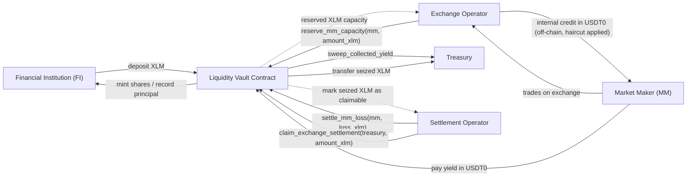

# Liquidity Vault Design

## Overview

This document sketches a `liquidity_vault` contract for the Stellar Soroban setup in this repository.

The design is based on the following operating model:

- Financial institutions (FIs) deposit `XLM` into the vault.
- The vault keeps custody of the `XLM`.
- Market makers (MMs) do not take `XLM` out of the vault.
- Instead, the exchange operator reserves part of the vault's `XLM` capacity for a given MM.
- The exchange credits the MM internally with `USDT0` buying power based on the reserved `XLM` and a haircut such as `80%`.
- Trading happens on the exchange platform, not in the Soroban contract.
- If the MM realizes profit, the MM pays a yield to the vault in `USDT0`.
- If the MM realizes loss, the vault can seize reserved `XLM` collateral and make that amount claimable by the settlement operator for payout to treasury.

This design deliberately keeps principal and yield separate:

- `XLM` principal side: depositor funds, MM collateral reservations, liquidations, shortfalls.
- `USDT0` yield side: financing payments or profit-share payments owed by MMs.

That separation avoids mixing depositor solvency with a mocked or externally-priced `USDT0` balance.

## Why This Model

The existing rollup contract in [contracts/rollup/src/contract.rs](/Users/johnsonsu/Developer/rails/soroban-rollup-contract/contracts/rollup/src/contract.rs) assumes one collateral token and one solvency domain. That is suitable for direct deposits and withdrawals of a single token, but not for:

- `XLM` locked as collateral,
- internal exchange credit in `USDT0`,
- MM trading profit and loss off-chain,
- and yield paid back in `USDT0`.

The revised `liquidity_vault` is therefore a collateral-locking and settlement contract, not a spot-asset lending contract.

## Scope

The contract should support:

- FI deposits of `XLM`.
- FI withdrawals of `XLM`.
- Reserving `XLM` capacity for an MM.
- Releasing unused MM reserved capacity.
- Seizing reserved `XLM` to cover realized MM losses.
- Making seized `XLM` claimable by the settlement operator for payout to treasury.
- Accepting `USDT0` yield payments from MMs.
- Tracking unpaid MM yield obligations in `USDT0`.
- Recording residual shortfalls when MM loss exceeds reserved collateral.

The contract should not:

- transfer vault `XLM` to the MM for trading,
- perform an on-chain swap from `XLM` to `USDT0`,
- hold MM trading positions,
- or try to calculate exchange PnL on-chain.

Those responsibilities belong to the exchange operator and the exchange risk engine.

## High-Level Flow

1. FI deposits `XLM` into the vault.
2. The vault issues FI shares or records FI principal ownership.
3. The exchange operator reserves some `XLM` capacity in the vault for a specific MM.
4. The exchange values the reserved `XLM` and applies a haircut, for example `80%`.
5. The exchange credits the MM internally with `USDT0` buying power.
6. The MM trades on the exchange.
7. At settlement time:
   - if the MM made profit, the MM pays yield in `USDT0`,
   - if the MM made loss, some or all reserved `XLM` is seized,
   - if loss exceeds reserved `XLM`, the residual becomes a shortfall.
8. The settlement operator may later claim seized `XLM` from the vault and send it to treasury.

## Diagram



Key points shown in the diagram:

- `XLM` stays in the vault until withdrawal or exchange settlement claim.
- The MM receives exchange credit, not on-chain `XLM`.
- Yield enters the vault in `USDT0`.
- Losses are settled by seizing reserved `XLM`, then optionally withdrawing it later to treasury through the settlement operator.

## Trust Model

The contract trusts the operator or a designated settlement authority to submit:

- MM reserve and release instructions,
- realized loss in `XLM` terms,
- MM yield due and yield paid in `USDT0`,
- liquidation and freeze decisions.

This means the contract is not a trustless risk engine. It is an auditable settlement layer for custody and entitlement.

## Roles

The design uses the following roles:

- `ExchangeOperator`
  - reserves and releases MM capacity,
  - computes internal MM credit on the exchange,
  - and runs the exchange risk engine.

- `SettlementOperator`
  - submits realized MM loss settlements,
  - freezes and liquidates MM accounts in the vault,
  - and executes `claim_exchange_settlement(...)` when seized `XLM` should be paid out.

- `Treasury`
  - receives swept `USDT0` yield,
  - receives seized `XLM` after settlement payout,
  - and may provide shortfall top-ups.

- `FI`
  - deposits and withdraws principal in `XLM`.

- `MM`
  - receives internal exchange credit,
  - trades on the exchange,
  - and pays yield in `USDT0`.

In a smaller deployment, `ExchangeOperator` and `SettlementOperator` may be the same entity, but they should still be modeled as distinct responsibilities.

## Recommended Asset Model

### Principal Side

The principal side remains entirely in `XLM`.

This side tracks:

- FI deposits and withdrawals,
- MM reserved collateral,
- seized collateral,
- and any recognized shortfall.

### Yield Side

The yield side is tracked in `USDT0`.

This side tracks:

- `USDT0` actually paid into the vault,
- unpaid `USDT0` obligations from MMs,
- and treasury sweeps of collected yield.

The principal side and yield side should not be merged in v1.

## Contract State

Below is a simple but concrete state model.

### Global State

- `Owner`
- `XlmToken`
- `YieldToken`
- `TotalShares`
- `PrincipalPoolXlm`
- `FreePrincipalXlm`
- `TotalReservedForMmXlm`
- `ExchangeClaimableXlm`
- `CollectedYieldUsdt0`
- `RecognizedShortfallXlm`
- `LatestSettlementEpoch`

### Per-User State

- `ShareBalance(user)`
- `PendingWithdrawalXlm(user)`

### Per-MM State

- `ReservedForMmXlm(mm)`
- `SeizedCollateralXlm(mm)`
- `UnpaidYieldUsdt0(mm)`
- `MmStatus(mm)` such as `Active`, `Frozen`, `Liquidating`, `Closed`
- `CreditHaircutBps(mm)` or a global haircut configuration

## Core Invariants

The contract should preserve the following invariants:

- `FreePrincipalXlm + TotalReservedForMmXlm <= PrincipalPoolXlm`
- `ExchangeClaimableXlm <= sum(SeizedCollateralXlm(mm) not yet claimed)`
- `CollectedYieldUsdt0` only increases when `USDT0` is actually transferred in
- `UnpaidYieldUsdt0(mm)` is never directly withdrawable
- FI withdrawals only come from free principal that is not reserved or already claimable by the exchange
- reserve releases and liquidation updates must not make balances negative

## Credit Policy

The exchange computes MM credit off-chain using the reserved `XLM`, market price, and haircut.

Example:

- `ReservedForMmXlm = 2,000`
- mark price = `1 XLM = 0.10 USDT0`
- haircut = `80%`

Then:

`MM credit = 2,000 * 0.10 * 0.80 = 160 USDT0`

This credit exists on the exchange platform only. It does not exist as `USDT0` inside the vault.

## Settlement Methods

The following methods are recommended for the `liquidity_vault` contract.

### Initialization and Configuration

#### `__constructor(xlm_token, yield_token, owner)`

Initializes the vault.

#### `set_mm_terms(mm, haircut_bps, enabled)`

Admin-only.

Stores the MM's haircut and whether the MM can receive new reservations.

### FI Methods

#### `deposit(user, amount_xlm) -> shares_minted`

- Transfers `XLM` from the user into the vault.
- Mints shares or equivalent principal accounting.
- Increases `PrincipalPoolXlm`.
- Increases `FreePrincipalXlm`.

#### `request_withdraw(user, shares_or_amount)`

- Converts shares into a pending `XLM` amount.
- Marks pending withdrawal.
- Should fail if the vault cannot safely satisfy the request.

#### `claim_withdraw(user)`

- Transfers pending `XLM` from vault to user.
- Decreases `PrincipalPoolXlm`.
- Decreases `FreePrincipalXlm`.

### MM Reservation Methods

#### `reserve_mm_capacity(mm, amount_xlm)`

`ExchangeOperator`-only.

- Moves `amount_xlm` from free principal into MM-reserved principal.
- Increases `ReservedForMmXlm(mm)`.
- Decreases `FreePrincipalXlm`.
- Increases `TotalReservedForMmXlm`.

#### `release_mm_capacity(mm, amount_xlm)`

`ExchangeOperator`-only.

- Releases unused reserved collateral for the MM.
- Decreases `ReservedForMmXlm(mm)`.
- Increases `FreePrincipalXlm`.
- Decreases `TotalReservedForMmXlm`.

This should only be allowed when the exchange confirms the MM no longer needs that reserved capacity.

### Yield Settlement Methods

#### `settle_mm_yield(mm, epoch_id, yield_due_usdt0, yield_paid_usdt0)`

`ExchangeOperator`-only.

- Records the amount of yield owed by the MM for the epoch.
- Transfers `yield_paid_usdt0` into the vault during settlement.
- Increases `CollectedYieldUsdt0` by the paid amount.
- Increases `UnpaidYieldUsdt0(mm)` by `max(yield_due_usdt0 - yield_paid_usdt0, 0)`.

Important rule:

- only the paid amount becomes collected yield,
- unpaid yield remains debt, not vault cash.

#### `pay_mm_yield(mm, amount_usdt0)`

- Transfers `USDT0` from the MM into the vault.
- Applies payment against `UnpaidYieldUsdt0(mm)`.
- Increases `CollectedYieldUsdt0`.

#### `sweep_collected_yield(to, amount_usdt0)`

`Treasury`-authorized or owner-authorized.

- Transfers collected `USDT0` from the vault to treasury or another destination.
- Decreases `CollectedYieldUsdt0`.

### Loss and Liquidation Methods

#### `freeze_mm(mm)`

`SettlementOperator`-only.

Prevents new reservations or releases while the MM is under review.

#### `settle_mm_loss(mm, epoch_id, loss_xlm)`

`SettlementOperator`-only.

- Applies a realized MM loss expressed in `XLM` terms.
- Seizes `min(loss_xlm, ReservedForMmXlm(mm))`.
- Decreases `ReservedForMmXlm(mm)` by the seized amount.
- Increases `SeizedCollateralXlm(mm)` by the seized amount.
- Increases `ExchangeClaimableXlm` by the seized amount.
- If `loss_xlm > ReservedForMmXlm(mm)` before seizure, the residual becomes `RecognizedShortfallXlm`.

This function only updates accounting. It does not immediately transfer `XLM` out of the vault.

#### `liquidate_mm(mm)`

`SettlementOperator`-only.

Marks the MM as liquidating or closed after final settlement.

#### `claim_exchange_settlement(to, amount_xlm)`

`SettlementOperator`-only.

- Transfers `XLM` from the vault to treasury or another designated settlement wallet.
- Decreases `ExchangeClaimableXlm`.

This is intentionally separate from `settle_mm_loss` so the settlement operator can choose when to withdraw seized `XLM` to treasury.

#### `top_up_shortfall(amount_xlm)`

Admin-only or sponsor-authorized.

- Transfers `XLM` into the vault.
- Decreases `RecognizedShortfallXlm`.
- Increases `PrincipalPoolXlm`.
- Increases `FreePrincipalXlm` if appropriate.

## Example State Keys

An example `DataKey` layout could be:

```rust
pub enum DataKey {
    XlmToken,
    YieldToken,
    TotalShares,
    PrincipalPoolXlm,
    FreePrincipalXlm,
    TotalReservedForMmXlm,
    ExchangeClaimableXlm,
    CollectedYieldUsdt0,
    RecognizedShortfallXlm,
    LatestSettlementEpoch,
    ShareBalance(Address),
    PendingWithdrawalXlm(Address),
    ReservedForMmXlm(Address),
    SeizedCollateralXlm(Address),
    UnpaidYieldUsdt0(Address),
    MmStatus(Address),
    CreditHaircutBps(Address),
}
```

## Example Events

Useful events:

- `Deposit`
- `WithdrawRequested`
- `WithdrawClaimed`
- `MmCapacityReserved`
- `MmCapacityReleased`
- `MmYieldSettled`
- `MmYieldPaid`
- `YieldSwept`
- `MmFrozen`
- `MmLossSettled`
- `MmLiquidated`
- `ExchangeSettlementClaimed`
- `ShortfallToppedUp`

## Concrete Examples

The following examples use the same assumptions:

- mark price: `1 XLM = 0.10 USDT0`
- haircut: `80%`
- FI deposit: `10,000 XLM`
- MM reserve request: `2,000 XLM`

### Example 1: FI Deposits, Then MM Is Credited On The Platform

Initial state:

```text
PrincipalPoolXlm = 0
FreePrincipalXlm = 0
TotalReservedForMmXlm = 0
ReservedForMmXlm(MM1) = 0
CollectedYieldUsdt0 = 0
ExchangeClaimableXlm = 0
RecognizedShortfallXlm = 0
```

Step 1: FI deposits `10,000 XLM`

Contract call:

```text
deposit(FI1, 10,000)
```

State after deposit:

```text
PrincipalPoolXlm = 10,000
FreePrincipalXlm = 10,000
TotalReservedForMmXlm = 0
ReservedForMmXlm(MM1) = 0
CollectedYieldUsdt0 = 0
ExchangeClaimableXlm = 0
RecognizedShortfallXlm = 0
```

Step 2: operator reserves `2,000 XLM` for `MM1`

Contract call:

```text
reserve_mm_capacity(MM1, 2,000)
```

State after reserve:

```text
PrincipalPoolXlm = 10,000
FreePrincipalXlm = 8,000
TotalReservedForMmXlm = 2,000
ReservedForMmXlm(MM1) = 2,000
CollectedYieldUsdt0 = 0
ExchangeClaimableXlm = 0
RecognizedShortfallXlm = 0
```

Step 3: exchange credits MM1 internally

Off-chain calculation:

```text
reserved value = 2,000 XLM * 0.10 = 200 USDT0
MM credit = 200 * 80% = 160 USDT0
```

State after exchange credit:

```text
PrincipalPoolXlm = 10,000
FreePrincipalXlm = 8,000
TotalReservedForMmXlm = 2,000
ReservedForMmXlm(MM1) = 2,000
CollectedYieldUsdt0 = 0
ExchangeClaimableXlm = 0
RecognizedShortfallXlm = 0
```

Important observation:

- the vault still holds all `10,000 XLM`,
- no `XLM` was transferred to the MM,
- the `160 USDT0` exists only as internal exchange credit.

### Example 2: MM Realizes Profit And Pays Yield

Start from the state after Example 1.

Assume:

- MM1 earns `40 USDT0` profit on the exchange
- yield owed to the vault is `25%` of profit
- yield due is therefore `10 USDT0`

Step 1: exchange computes epoch settlement

Off-chain:

```text
profit = 40 USDT0
yield due = 10 USDT0
```

Step 2: MM pays the full yield

Contract call:

```text
settle_mm_yield(MM1, epoch_1, 10, 10)
```

State after settlement:

```text
PrincipalPoolXlm = 10,000
FreePrincipalXlm = 8,000
TotalReservedForMmXlm = 2,000
ReservedForMmXlm(MM1) = 2,000
CollectedYieldUsdt0 = 10
UnpaidYieldUsdt0(MM1) = 0
ExchangeClaimableXlm = 0
RecognizedShortfallXlm = 0
```

Important observation:

- FI principal in `XLM` is unchanged,
- `USDT0` yield is now actually held by the vault,
- that `USDT0` can later be swept to treasury.

Variant: MM only pays part of the yield

Contract call:

```text
settle_mm_yield(MM1, epoch_1, 10, 4)
```

State:

```text
CollectedYieldUsdt0 = 4
UnpaidYieldUsdt0(MM1) = 6
```

Important observation:

- only `4 USDT0` is collected and withdrawable,
- the remaining `6 USDT0` is just MM debt.

### Example 3: MM Realizes Loss And Is Liquidated

Start from the reserved state after Example 1.

Assume:

- MM1 loses `150 USDT0`
- at the settlement mark, that equals `1,500 XLM`

Step 1: exchange decides to liquidate MM1

Contract call:

```text
freeze_mm(MM1)
```

Step 2: operator settles the realized loss

Contract call:

```text
settle_mm_loss(MM1, epoch_2, 1,500)
```

State after loss settlement:

```text
PrincipalPoolXlm = 10,000
FreePrincipalXlm = 8,000
TotalReservedForMmXlm = 500
ReservedForMmXlm(MM1) = 500
SeizedCollateralXlm(MM1) = 1,500
ExchangeClaimableXlm = 1,500
CollectedYieldUsdt0 = 0
RecognizedShortfallXlm = 0
```

Important observation:

- the vault still physically holds the `XLM`,
- but `1,500 XLM` is now claimable by the exchange,
- only `500 XLM` remains reserved for MM1.

Step 3: exchange claims seized collateral

Contract call:

```text
claim_exchange_settlement(exchange_treasury, 1,500)
```

State after claim:

```text
PrincipalPoolXlm = 8,500
FreePrincipalXlm = 8,000
TotalReservedForMmXlm = 500
ReservedForMmXlm(MM1) = 500
SeizedCollateralXlm(MM1) = 1,500
ExchangeClaimableXlm = 0
CollectedYieldUsdt0 = 0
RecognizedShortfallXlm = 0
```

Operationally:

- vault `XLM` balance on-chain is now lower by `1,500 XLM`,
- the exchange received reimbursement for the realized MM loss.

### Example 4: Liquidation With Shortfall

Start from the reserved state after Example 1.

Assume:

- MM1 loses `250 USDT0`
- at the settlement mark, that equals `2,500 XLM`
- MM1 only has `2,000 XLM` reserved

Contract call:

```text
settle_mm_loss(MM1, epoch_3, 2,500)
```

State after settlement:

```text
PrincipalPoolXlm = 10,000
FreePrincipalXlm = 8,000
TotalReservedForMmXlm = 0
ReservedForMmXlm(MM1) = 0
SeizedCollateralXlm(MM1) = 2,000
ExchangeClaimableXlm = 2,000
RecognizedShortfallXlm = 500
```

Important observation:

- all reserved collateral was consumed,
- there is still a `500 XLM` shortfall.

If a sponsor tops up immediately:

```text
top_up_shortfall(500)
```

State after top-up:

```text
RecognizedShortfallXlm = 0
PrincipalPoolXlm = 10,500
FreePrincipalXlm = 8,500
```

Whether `PrincipalPoolXlm` and `FreePrincipalXlm` are incremented in exactly this way depends on the final accounting implementation, but the key economic effect is:

- the shortfall is covered by external capital rather than FI principal.

### Example 5: XLM Price Drops By More Than The Haircut

Start from the reserved state after Example 1.

Assume:

- MM1 has `2,000 XLM` reserved
- initial mark price is `1 XLM = 0.10 USDT0`
- haircut is `80%`
- initial internal credit is therefore `160 USDT0`

Initial exchange-side calculation:

```text
reserved value = 2,000 XLM * 0.10 = 200 USDT0
credited amount = 200 * 80% = 160 USDT0
```

Now assume the market moves and the mark price drops to:

```text
1 XLM = 0.07 USDT0
```

The reserved collateral is now worth:

```text
2,000 XLM * 0.07 = 140 USDT0
```

That means the exchange has already credited `160 USDT0`, but the backing collateral is now only worth `140 USDT0`.

There is therefore a collateral deficit of:

```text
160 - 140 = 20 USDT0
```

At the new mark, that deficit equals:

```text
20 / 0.07 = 285.714285... XLM
```

In practice, the exchange would round according to its risk rules, for example to `286 XLM`.

Important observation:

- this price move alone does not automatically change vault state,
- the vault still holds the same `2,000 XLM`,
- and no loss is recognized on-chain yet.

State immediately after the price drop, before any exchange action:

```text
PrincipalPoolXlm = 10,000
FreePrincipalXlm = 8,000
TotalReservedForMmXlm = 2,000
ReservedForMmXlm(MM1) = 2,000
ExchangeClaimableXlm = 0
RecognizedShortfallXlm = 0
```

At that point, the exchange risk engine should take one or more off-chain actions:

- reduce MM1's internal credit,
- require the MM to add more collateral,
- or liquidate the MM.

If the exchange liquidates immediately and treats the under-collateralized amount as a realized loss of `286 XLM`, it would call:

```text
freeze_mm(MM1)
settle_mm_loss(MM1, epoch_4, 286)
```

State after this settlement:

```text
PrincipalPoolXlm = 10,000
FreePrincipalXlm = 8,000
TotalReservedForMmXlm = 1,714
ReservedForMmXlm(MM1) = 1,714
SeizedCollateralXlm(MM1) = 286
ExchangeClaimableXlm = 286
RecognizedShortfallXlm = 0
```

If the settlement operator then pays treasury:

```text
claim_exchange_settlement(treasury, 286)
```

State after payout:

```text
PrincipalPoolXlm = 9,714
FreePrincipalXlm = 8,000
TotalReservedForMmXlm = 1,714
ReservedForMmXlm(MM1) = 1,714
SeizedCollateralXlm(MM1) = 286
ExchangeClaimableXlm = 0
RecognizedShortfallXlm = 0
```

Important observation:

- the haircut protects against moderate price moves,
- but once price drops beyond the haircut buffer, the exchange must actively manage the MM,
- and the vault only changes state when the settlement operator submits a settlement action.

### Example 6: XLM Price Drops And The Exchange Reserves More XLM Instead Of Liquidating

Start from the reserved state after Example 1.

Assume:

- MM1 has `2,000 XLM` reserved
- initial mark price is `1 XLM = 0.10 USDT0`
- haircut is `80%`
- initial internal credit is therefore `160 USDT0`

Initial exchange-side calculation:

```text
reserved value = 2,000 XLM * 0.10 = 200 USDT0
credited amount = 200 * 80% = 160 USDT0
```

Now assume the mark price drops to:

```text
1 XLM = 0.07 USDT0
```

If the exchange wants to preserve the same `160 USDT0` credit without liquidating the MM, it must increase the reserved `XLM`.

The required reserve is:

```text
required_reserved_xlm = credited_usdt0 / (price_usdt0_per_xlm * haircut)
required_reserved_xlm = 160 / (0.07 * 0.80)
required_reserved_xlm = 2,857.14 XLM
```

In practice, the exchange would round according to its risk rules, for example to `2,858 XLM`.

That means the exchange needs approximately:

```text
2,858 - 2,000 = 858 XLM
```

more reserve for MM1.

Important observation:

- this is not a realized loss settlement,
- no `XLM` leaves the vault,
- and `ExchangeClaimableXlm` does not change.

State immediately before reserve top-up:

```text
PrincipalPoolXlm = 10,000
FreePrincipalXlm = 8,000
TotalReservedForMmXlm = 2,000
ReservedForMmXlm(MM1) = 2,000
ExchangeClaimableXlm = 0
RecognizedShortfallXlm = 0
```

Contract call:

```text
reserve_mm_capacity(MM1, 858)
```

State after reserve top-up:

```text
PrincipalPoolXlm = 10,000
FreePrincipalXlm = 7,142
TotalReservedForMmXlm = 2,858
ReservedForMmXlm(MM1) = 2,858
ExchangeClaimableXlm = 0
RecognizedShortfallXlm = 0
```

Economic interpretation:

- the exchange maintained MM1's `160 USDT0` internal credit,
- the vault increased the amount of FI principal encumbered behind MM1,
- and no liquidation occurred.

Operationally, this is a risk increase for the vault. If the design allows this path, it should usually be guarded by:

- per-MM reserve caps,
- global reserve utilization limits,
- and operator policies requiring the MM to reduce risk or add support before more vault capacity is reserved.

## Design Notes

### Why `claim_exchange_settlement` Should Be Separate

The contract should separate:

- accounting the seized amount,
- and actually transferring `XLM` out to the exchange.

This allows the operator to:

- delay market sale of seized `XLM`,
- net multiple settlement claims,
- or withdraw in tranches.

### Why Yield Should Not Be Treated Like Withdrawal Allowance

The current rollup contract uses withdrawal allowances as a user liability already reserved in contract balance. That is not the right model for MM yield.

MM yield should instead follow this rule:

- only paid `USDT0` becomes collected yield,
- unpaid yield remains MM debt.

Otherwise the vault would incorrectly treat an IOU as cash.

### Why No Oracle Is Needed In The Vault For V1

In this design, the exchange uses price data to determine:

- how much internal `USDT0` credit an MM gets,
- when liquidation should happen,
- and how a realized loss maps into `XLM`.

The vault only receives the final settlement number in `XLM` terms or `USDT0` payment terms.

That means the vault itself does not need an oracle for core v1 custody and settlement logic.

## Recommended Next Step

Implement the new `liquidity_vault` as a separate contract rather than trying to extend the current rollup contract.

That new contract should begin with:

- `DataKey`
- `ContractError`
- events
- `deposit`
- `request_withdraw`
- `claim_withdraw`
- `reserve_mm_capacity`
- `release_mm_capacity`
- `settle_mm_yield`
- `pay_mm_yield`
- `freeze_mm`
- `settle_mm_loss`
- `claim_exchange_settlement`
- `top_up_shortfall`

The existing rollup contract can remain focused on single-token batch deposit and withdrawal logic.
