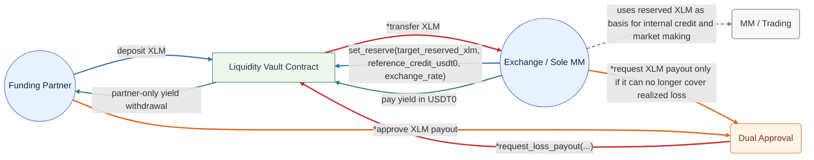

# Managed Liquidity Vault Design

## Overview

This document sketches a more human-managed liquidity vault.

This version assumes:

- there is exactly one trusted third-party funding partner,
- there is exactly one market maker, and that market maker is the exchange itself,
- the vault is operated cooperatively by the exchange and the funding partner,
- and dual-signing is required when `XLM` leaves the vault.

The goal of this design is to reduce operational complexity by replacing multi-user accounting and more automated flows with explicit exchange-managed accounting and dual approval only for `XLM` outflows.

This design intentionally drops:

- share minting,
- per-user accounting,
- per-MM accounting,
- separate treasury and settlement roles,
- and most automation around liquidation and collateral management.

## Core Assumptions

### Parties

- `Exchange`
  - runs the exchange,
  - is the only market maker using the vault,
  - pays yield into the vault,
  - covers realized trading losses with its own resources first,
  - and may only request `XLM` payout from the vault after it can no longer continue covering those losses.

- `FundingPartner`
  - is the only external party allowed to deposit `XLM`,
  - is the economic owner of the vault principal,
  - is the party that tops up `XLM` when more collateral principal is needed because of exchange-rate moves,
  - and is the only party allowed to withdraw accumulated yield from the vault.

### Governance

The funding partner is agreeing that the deposited `XLM` may be used by the exchange as vault collateral.

Because of that, the exchange can adjust how much of the vault is reserved as collateral without dual approval. This is expected to be a periodic operational adjustment based on exchange rate moves and exchange credit needs.

The cleanest contract shape for this is a single set-reserve function rather than separate reserve and release functions.

Dual-signing is reserved for actions where `XLM` actually leaves the vault.

Examples:

- withdrawing partner principal,
- paying out realized-loss `XLM` to the exchange,
- and any other direct `XLM` transfer out of the vault.

This can be modeled directly in Soroban by requiring both addresses to authorize outflow methods.

### Loss Waterfall

The intended loss waterfall in this design is:

1. the exchange absorbs realized trading losses with its own balance sheet first,
2. no periodic on-chain loss settlement is needed while the exchange can continue covering those losses,
3. only if the exchange can no longer continue covering realized losses does it request `XLM` from the vault,
4. and that `XLM` payout requires dual approval by the exchange and the funding partner.

This means the vault does not need a regularly scheduled loss-settlement process. It only needs a loss-payout process when reimbursement is actually needed.

### Collateral Maintenance

The intended collateral-maintenance flow in this design is:

1. the exchange monitors the effective collateral value off-chain based on the current `XLM/USDT0` rate and its internal credit exposure,
2. the exchange periodically updates the vault's reserved `XLM` target through `set_reserve(...)`,
3. if more `XLM` principal is needed to keep the desired collateral coverage, the funding partner deposits more `XLM` into the vault,
4. and this top-up is expected to happen before collateral becomes insufficient, for example when reserved collateral approaches an agreed utilization threshold such as `80%` of principal.

This means `XLM` top-up is a partner funding action driven by collateral coverage, not a response to realized trading loss.

### Asset Model

This design still keeps the two assets separate:

- `XLM` is the principal/collateral asset.
- `USDT0` is the yield asset.

In this design, there is no need for:

- user shares,
- partner share price,
- or multi-MM state.

## Why This Design Is Simpler

This design simplifies the system in the following ways:

- only one depositor means no share ledger is needed,
- only one MM means no per-MM maps are needed,
- the exchange and MM are the same entity,
- treasury and settlement functions can be folded into the exchange/partner relationship,
- and manual dual-signature approval replaces much of the need for on-chain guardrail automation.

The tradeoff is that the contract becomes more trust-based and less suitable for broad external participation.

## Simplified Roles

This design uses only two business roles:

- `Exchange`
- `FundingPartner`

In practice, this means:

- `Exchange` proposes and executes exchange-side actions,
- `FundingPartner` approves `XLM` outflows,
- and the contract enforces dual authorization only where principal leaves the vault.

## Managed Flow

1. The funding partner deposits `XLM` into the vault.
2. The exchange sets how much of that `XLM` is reserved as exchange collateral.
   - this reserve can be adjusted periodically by the exchange as exchange rate and credit needs change.
3. The exchange credits itself internally in `USDT0` based on the reserved `XLM` and haircut.
4. The exchange trades using its own internal market-making activity.
5. At settlement time, the exchange may:
   - keep collateral unchanged,
   - increase reserved collateral,
   - decrease reserved collateral,
   - or record additional yield debt.
6. The exchange continues covering realized losses with its own resources for as long as it is able.
7. If the exchange can no longer continue covering realized losses and needs reimbursement from the vault, both parties sign that `XLM` payout request.
8. The exchange pays `USDT0` yield into the vault over time.
9. Only the funding partner can withdraw the accumulated `USDT0` yield.

## Diagram



> \* Only happens when the Exchange cannot cover the loss
>
> Color guide: blue = principal/collateral setup, green = yield flow, gray = off-chain trading, orange/red = exceptional loss reimbursement flow

Key points shown in the diagram:

- the only depositor is the funding partner,
- the only MM is the exchange,
- the exchange controls how much deposited `XLM` is reserved as collateral,
- the exchange covers realized losses first using its own resources,
- `XLM` leaves the vault only when both parties approve the outflow,
- and yield in `USDT0` can only be withdrawn by the funding partner.

## Trust Model

This contract is intentionally trust-heavy.

The exchange and funding partner are assumed to:

- agree commercially that deposited `XLM` is available for exchange-controlled collateral reservation,
- review exchange reports and settlement records off-chain,
- agree on the process for exchange-rate marks and realized-loss calculations,
- and co-sign only when `XLM` leaves the vault.

The contract's job is therefore not to automate risk management. Its job is to:

- store assets,
- record exchange-managed state transitions,
- and make it hard for either side to move `XLM` out of the vault unilaterally.

## State Model

Because there is only one depositor and one MM, the state can be collapsed to global balances.

### Global State

- `Owner`
- `Exchange`
- `FundingPartner`
- `XlmToken`
- `YieldToken`
- `PartnerPrincipalXlm`
- `FreePrincipalXlm`
- `ReservedForExchangeXlm`
- `CollectedYieldUsdt0`
- `YieldDebtUsdt0`
- `LatestSettlementEpoch`

### Optional Audit State

- `LastSetReserveExchangeRate`
- `LastSetReserveReferenceCreditUsdt0`
- `LastSettlementMemoHash`
- `VaultStatus`

These are not strictly required, but they help with off-chain reconciliation and audit trails.

## State Interpretation

- `PartnerPrincipalXlm`
  - total `XLM` principal contributed by the funding partner and still tracked as partner-owned principal inside the vault.

- `FreePrincipalXlm`
  - `XLM` not currently reserved for exchange collateral and not already claimable by the exchange.

- `ReservedForExchangeXlm`
  - `XLM` currently reserved as collateral backing the exchange's internal credit.

- `CollectedYieldUsdt0`
  - `USDT0` yield actually paid into the vault and available for the funding partner to withdraw.

- `YieldDebtUsdt0`
  - `USDT0` yield owed by the exchange but not yet paid into the vault.

## Core Invariants

- `FreePrincipalXlm + ReservedForExchangeXlm <= PartnerPrincipalXlm`
- `CollectedYieldUsdt0 >= 0`
- `YieldDebtUsdt0 >= 0`
- `CollectedYieldUsdt0` only increases when `USDT0` is actually transferred in
- only the funding partner may withdraw collected yield

## Governance Pattern

For this design, the simplest governance pattern is:

- partner-only calls for pure funding actions,
- exchange-only calls for collateral management and settlement accounting,
- and dual-sign calls for `XLM` outflows.

### Partner-Only

- `deposit_partner(amount_xlm)`
- `withdraw_partner_yield(to, amount_usdt0)`

### Exchange-Only

- `set_reserve(target_reserved_xlm, reference_credit_usdt0, exchange_rate, memo_hash)`
- `record_yield_settlement(...)`
- `pay_yield(amount_usdt0)`

### Dual-Sign

- `withdraw_partner_principal(to, amount_xlm)`
- `request_loss_payout(to, amount_xlm, memo_hash)`

## Recommended Methods

### Initialization

#### `__constructor(xlm_token, yield_token, exchange, funding_partner, owner)`

Initializes the contract with the two business parties.

### Funding Methods

#### `deposit_partner(amount_xlm)`

`FundingPartner`-only.

- Transfers `XLM` from the funding partner into the vault.
- Increases `PartnerPrincipalXlm`.
- Increases `FreePrincipalXlm`.

#### `withdraw_partner_principal(to, amount_xlm)`

Dual-sign by `Exchange` and `FundingPartner`.

- Transfers free `XLM` principal from the vault to the funding partner.
- Decreases `PartnerPrincipalXlm`.
- Decreases `FreePrincipalXlm`.

This is dual-approved because `XLM` leaves the vault.

### Collateral Management

#### `set_reserve(target_reserved_xlm, reference_credit_usdt0, exchange_rate, memo_hash)`

`Exchange`-only.

- Sets the total reserved collateral to `target_reserved_xlm`.
- Updates `ReservedForExchangeXlm`.
- Updates `FreePrincipalXlm` as the remaining unreserved `XLM`.
- Stores `reference_credit_usdt0`, `exchange_rate`, and `memo_hash` as audit metadata for the exchange's off-chain reserve calculation.

This is intentionally exchange-controlled because the deposited `XLM` is already agreed to be available as collateral.

This method replaces separate reserve and release methods. It is easier to reconcile because the exchange always writes the current target reserve state rather than issuing a delta.

The contract should validate basic balance constraints, but it does not need to recompute the reserve requirement from price on-chain.

### Yield Methods

#### `record_yield_settlement(epoch_id, yield_due_usdt0, yield_paid_usdt0, memo_hash)`

`Exchange`-only.

- Records agreed yield due for the epoch.
- Transfers `yield_paid_usdt0` into the vault.
- Increases `CollectedYieldUsdt0` by the amount paid.
- Increases `YieldDebtUsdt0` by any unpaid portion.
- Updates `LatestSettlementEpoch`.

This method records the exchange's settlement accounting without moving `XLM` out of the vault.

#### `pay_yield(amount_usdt0)`

`Exchange`-only.

- Transfers `USDT0` into the vault.
- Reduces `YieldDebtUsdt0` by up to the paid amount.
- Increases `CollectedYieldUsdt0`.

This is safe as an exchange-only method because it can only improve partner position.

#### `withdraw_partner_yield(to, amount_usdt0)`

`FundingPartner`-only.

- Transfers collected `USDT0` yield from the vault to the funding partner.
- Decreases `CollectedYieldUsdt0`.

### Loss Settlement

#### `request_loss_payout(to, amount_xlm, memo_hash)`

Dual-sign by `Exchange` and `FundingPartner`.

- Transfers `XLM` from the vault to the exchange or a designated settlement wallet.
- Decreases `ReservedForExchangeXlm` by `amount_xlm`.
- Decreases `PartnerPrincipalXlm`.
- Updates `LastSettlementMemoHash`.

This method is only used when the exchange has determined that it can no longer continue covering realized losses with its own resources and needs reimbursement from the vault.

The contract should enforce `amount_xlm <= ReservedForExchangeXlm`, so only the reserved portion of vault collateral can be paid out through this path.

## Example `DataKey`

```rust
pub enum DataKey {
    Owner,
    Exchange,
    FundingPartner,
    XlmToken,
    YieldToken,
    PartnerPrincipalXlm,
    FreePrincipalXlm,
    ReservedForExchangeXlm,
    CollectedYieldUsdt0,
    YieldDebtUsdt0,
    LatestSettlementEpoch,
    LastSetReserveExchangeRate,
    LastSetReserveReferenceCreditUsdt0,
    LastSettlementMemoHash,
    VaultStatus,
}
```

## Example Events

- `PartnerDeposit`
- `PartnerPrincipalWithdrawn`
- `ReserveSet`
- `YieldSettlementRecorded`
- `YieldPaid`
- `PartnerYieldWithdrawn`
- `LossPayoutRequested`

## Concrete Examples

The following examples use:

- initial mark price: `1 XLM = 0.10 USDT0`
- haircut: `80%`
- funding partner deposit: `10,000 XLM`

### Example 1: Partner Deposits And Exchange Reserves Collateral

Initial state:

```text
PartnerPrincipalXlm = 0
FreePrincipalXlm = 0
ReservedForExchangeXlm = 0
CollectedYieldUsdt0 = 0
YieldDebtUsdt0 = 0
```

Step 1: funding partner deposits `10,000 XLM`

Contract call:

```text
deposit_partner(10,000)
```

State:

```text
PartnerPrincipalXlm = 10,000
FreePrincipalXlm = 10,000
ReservedForExchangeXlm = 0
CollectedYieldUsdt0 = 0
YieldDebtUsdt0 = 0
```

Step 2: exchange sets the reserve to `2,000 XLM`

Contract call:

```text
set_reserve(2,000, 160, 0.10, memo_hash)
```

State:

```text
PartnerPrincipalXlm = 10,000
FreePrincipalXlm = 8,000
ReservedForExchangeXlm = 2,000
CollectedYieldUsdt0 = 0
YieldDebtUsdt0 = 0
```

Off-chain exchange credit:

```text
reserved value = 2,000 XLM * 0.10 = 200 USDT0
exchange credit = 200 * 80% = 160 USDT0
```

Important observation:

- no shares were minted,
- the funding partner remains the sole economic owner of principal,
- and no `XLM` left the vault.

### Example 2: Exchange Earns Profit And Pays Yield

Start from the state after Example 1.

Assume:

- exchange trading profit for the epoch is `40 USDT0`
- agreed yield share is `25%`
- yield due is `10 USDT0`
- exchange pays the full amount during settlement

Contract call:

```text
record_yield_settlement(epoch_1, 10, 10, memo_hash)
```

State after settlement:

```text
PartnerPrincipalXlm = 10,000
FreePrincipalXlm = 8,000
ReservedForExchangeXlm = 2,000
CollectedYieldUsdt0 = 10
YieldDebtUsdt0 = 0
```

Later, the funding partner withdraws the yield:

```text
withdraw_partner_yield(partner_wallet, 10)
```

State after yield withdrawal:

```text
CollectedYieldUsdt0 = 0
```

Important observation:

- only the funding partner can extract the `USDT0` yield,
- and principal-side `XLM` state is unchanged.

### Example 3: Exchange Requests Loss Payout Only When Reimbursement Is Needed

Start from the reserved state after Example 1.

Assume:

- realized loss is `1,500 XLM`
- the exchange continues covering that loss with its own resources for some time

Later, the exchange can no longer continue covering that realized loss and both parties approve payout from the vault:

```text
request_loss_payout(exchange_settlement_wallet, 1,500, memo_hash)
```

State after payout:

```text
PartnerPrincipalXlm = 8,500
FreePrincipalXlm = 8,000
ReservedForExchangeXlm = 500
CollectedYieldUsdt0 = 0
YieldDebtUsdt0 = 0
```

Important observation:

- the exchange may continue carrying that loss off-chain for some period,
- and only when reimbursement is actually needed does the vault participate through a dual-approved `XLM` payout.

### Example 4: Exchange Rate Drops, And The Exchange Increases Reserve Instead Of Recognizing Loss

Start from the reserved state after Example 1.

Assume:

- reserved collateral is `2,000 XLM`
- current exchange credit is `160 USDT0`
- mark price drops from `0.10` to `0.07 USDT0/XLM`

Required reserve to keep the same credit:

```text
required_reserved_xlm = 160 / (0.07 * 0.80) = 2,857.14 XLM
```

Rounded required reserve:

```text
2,858 XLM
```

Additional reserve needed:

```text
2,858 - 2,000 = 858 XLM
```

Instead of realizing a loss, the exchange updates the total reserve target:

```text
set_reserve(2,858, 160, 0.07, memo_hash)
```

State after reserve increase:

```text
PartnerPrincipalXlm = 10,000
FreePrincipalXlm = 7,142
ReservedForExchangeXlm = 2,858
CollectedYieldUsdt0 = 0
YieldDebtUsdt0 = 0
```

Important observation:

- no loss was recognized,
- no `XLM` left the vault,
- and more of the partner's principal is now encumbered behind exchange risk under exchange control.

### Example 5: Partner Tops Up Principal When More Collateral Is Needed

Start from the reserved state after Example 4.

Assume:

- the exchange wants to maintain its internal `USDT0` credit,
- the `XLM/USDT0` exchange rate keeps falling,
- and the exchange determines that reserved collateral is approaching the agreed utilization threshold, for example `80%` of partner principal.

At this point, instead of waiting until collateral becomes insufficient, the funding partner tops up the vault:

```text
deposit_partner(2,000)
```

State after partner top-up:

```text
PartnerPrincipalXlm = 12,000
FreePrincipalXlm = 9,142
ReservedForExchangeXlm = 2,858
CollectedYieldUsdt0 = 0
YieldDebtUsdt0 = 0
```

Important observation:

- this is the intended `XLM` top-up path,
- the top-up is performed by the funding partner,
- and it is driven by collateral maintenance rather than realized trading loss.

### Example 6: Realized Loss Exceeds Reserved Collateral

Start from the reserved state after Example 1.

Assume:

- realized loss is `2,500 XLM`
- only `2,000 XLM` is reserved

If the exchange later needs reimbursement from the vault, it can only request the reserved portion:

```text
request_loss_payout(exchange_settlement_wallet, 2,000, memo_hash)
```

State after payout:

```text
PartnerPrincipalXlm = 8,000
FreePrincipalXlm = 8,000
ReservedForExchangeXlm = 0
CollectedYieldUsdt0 = 0
YieldDebtUsdt0 = 0
```

Interpretation after payout:

- `2,000 XLM` was the maximum amount the vault could reimburse because that was the reserved collateral,
- and the remaining `500 XLM` stays on the exchange's own balance sheet unless the parties later agree on some separate off-chain arrangement.

Important observation:

- the vault does not have a special realized-loss top-up path,
- realized trading loss is first borne by the exchange,
- and partner `XLM` top-ups are for collateral maintenance driven by exchange rate, not for reimbursing trading loss.

## Design Notes

### Why Eliminate Shares

Because there is only one funding partner, a share system adds bookkeeping but not much value.

The simpler rule is:

- all principal belongs to the funding partner,
- while collateral reservation is exchange-controlled and `XLM` outflows remain dual-approved.

### Why Keep `XLM` And `USDT0` Separate

In this design, separating:

- principal and collateral in `XLM`,
- and yield in `USDT0`

keeps reconciliation simpler and avoids forcing FX mark-to-market into partner principal accounting.

### Why Use Dual-Signed `XLM` Outflows Instead Of More Automation

This model assumes the exchange and funding partner are close counterparties who are willing to review settlements manually.

That makes it reasonable to prefer:

- fewer state objects,
- fewer automated liquidation paths,
- and a smaller method surface,

over more fully automated on-chain risk controls.

## Recommended Next Step

The contract can likely start with just:

- `deposit_partner`
- `withdraw_partner_principal`
- `set_reserve`
- `record_yield_settlement`
- `pay_yield`
- `withdraw_partner_yield`
- `request_loss_payout`

This keeps the contract focused while still preserving an auditable on-chain record of collateral reservation, loss settlement, and yield collection.
