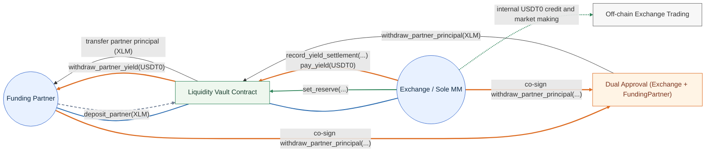

# Managed Liquidity Vault Design

## Overview

This document sketches a liquidity vault between Stellar and Rails. It highlights how main risks are managed, including FX risk between `XLM` and `USDT0`. It also proposes how principal withdrawal is managed with dual approval and how yield is recorded and paid by the exchange.

## Core Assumptions

### Parties

- `Exchange (Rails)`
  - runs the exchange,
  - is the only market maker using the vault,
  - pays yield into the vault,
  - covers realized trading losses with its own resources

- `FundingPartner (Stellar)`
  - is the only external party allowed to deposit `XLM`,
  - is the economic owner of the vault principal,
  - and is the only party allowed to withdraw accumulated yield from the vault.

### Governance

The funding partner is agreeing that the deposited `XLM` may be used by the exchange as vault collateral.

Because of that, the exchange can adjust how much of the vault is reserved as collateral. This is expected to be a periodic operational adjustment based on exchange rate moves and exchange credit needs.

Dual-signing is reserved for partner-principal withdrawal. This is modeled directly in Soroban by requiring both addresses to authorize the partner-principal withdrawal method.

Upgrade authority is intentionally separate from these business operations.

- `Owner` should be a dedicated governance address, not the `Exchange` or the `FundingPartner`
- `Owner` should only be used for contract upgrade
- `Owner` should be treated as immutable from the vault contract's point of view
- ownership rotation should not be exposed through the vault contract API

In practice, the recommended setup is for `Owner` to be a separate governance multisig address controlled jointly off-chain by the exchange and funding partner.

### Collateral Maintenance

The intended collateral-maintenance flow in this design is:

1. the exchange monitors the effective collateral value off-chain based on the current `XLM/USDT0` rate and its internal credit exposure,
   - the “internal credit exposure” is the total amount of `USDT0` the exchange uses for market making. This exists in the exchange's internal ledger, not in the vault contract. The vault only sees the resulting `set_reserve(...)` target and related audit metadata.
2. the exchange periodically updates the vault's reserved `XLM` target through `set_reserve(...)`,
3. if more `XLM` principal is needed to keep the desired collateral coverage, the funding partner deposits more `XLM` into the vault,
4. and this top-up is only expected to happen before collateral becomes insufficient, for example when reserved collateral approaches an agreed utilization threshold such as `80%` of principal.

### Asset Model

This design still keeps the two assets separate:

- `XLM` is the principal/collateral asset.
- `USDT0` is the yield asset.

The exchange may use the reserved `XLM` only as the basis for off-chain internal `USDT0` credit. The vault itself remains an `XLM` principal vault plus a separate `USDT0` yield bucket.

## Smart Contract Architecture

### Managed Flow

1. The funding partner deposits `XLM` into the vault.
2. The exchange sets how much of that `XLM` is reserved as exchange collateral.
   - this reserve can be adjusted periodically by the exchange as the exchange rate and credit needs change.
3. The exchange credits itself internally in `USDT0` based on the reserved `XLM`.
4. The exchange trades using its own internal market-making activity.
5. At settlement time, the exchange may:
   - keep collateral unchanged,
   - increase reserved collateral,
   - decrease reserved collateral,
   - or record additional yield debt.
6. The exchange continues covering realized losses with its own resources.
7. The exchange pays `USDT0` yield into the vault over time.
8. Only the funding partner can withdraw the accumulated `USDT0` yield.

### Diagram



Key points shown in the diagram:

- the only depositor is the funding partner,
- the only MM is the exchange,
- the exchange controls how much deposited `XLM` is reserved as collateral,
- the exchange covers realized losses first using its own resources,
- the exchange does not receive `XLM` reimbursement from the vault,
- and partner principal can leave the vault only when both parties approve the withdrawal,
- and yield in `USDT0` can only be withdrawn by the funding partner.

### State Model

Because there is only one depositor and one MM, the state can be collapsed to global balances.

#### Global State

- `Owner`
- `Exchange`
- `FundingPartner`
- `XlmToken`
- `YieldToken`
- `PartnerPrincipalXlm`
- `FreePrincipalXlm`
- `ReservedForExchangeXlm`
- `CollectedYieldUsdt0`
- `YieldDebtUsdt0`
- `LatestSettlementEpoch`

#### Optional Audit State

- `LastSetReserveExchangeRate`
- `LastSetReserveCredit`
- `LastReserveReferenceHash`
- `LastYieldSettlementReferenceHash`

These are not strictly required, but they help with off-chain reconciliation and audit trails.

#### State Interpretation

- `Owner`
  - immutable governance owner used only for contract upgrade
  - not used for normal vault operations
  - should be a separate governance address rather than either business party directly

- `PartnerPrincipalXlm`
  - total `XLM` principal contributed by the funding partner and still tracked as partner-owned principal inside the vault.

- `FreePrincipalXlm`
  - `XLM` not currently reserved for exchange collateral.

- `ReservedForExchangeXlm`
  - `XLM` currently reserved as collateral backing the exchange's internal credit.

- `CollectedYieldUsdt0`
  - `USDT0` yield actually paid into the vault and available for the funding partner to withdraw.

- `YieldDebtUsdt0`
  - `USDT0` yield owed by the exchange but not yet paid into the vault.

### Core Invariants

- `FreePrincipalXlm + ReservedForExchangeXlm = PartnerPrincipalXlm`
- `CollectedYieldUsdt0 >= 0`
- `YieldDebtUsdt0 >= 0`
- `ReservedForExchangeXlm` must be large enough to cover `reference_credit_usdt0` under the provided `exchange_rate`
- `CollectedYieldUsdt0` only increases when `USDT0` is actually transferred in
- only the funding partner may withdraw collected yield

### Governance Pattern

For this design, the simplest governance pattern is:

- partner-only calls for pure funding actions,
- exchange-only calls for collateral management and settlement accounting,
- and dual-sign calls for partner principal withdrawal.

#### Partner-Only

- `deposit_partner(amount_xlm)`
- `withdraw_partner_yield(to, amount_usdt0)`

#### Exchange-Only

- `set_reserve(target_reserved_xlm, reference_credit_usdt0, exchange_rate, reference_hash)`
- `record_yield_settlement(...)`
- `pay_yield(amount_usdt0)`

#### Dual-Sign

- `withdraw_partner_principal(to, amount_xlm)`

### Proposed Methods

#### Initialization

##### \_\_constructor(xlm_token, yield_token, exchange, funding_partner, owner)

Initializes the contract with the two business parties and the separate upgrade-only governance owner.

#### Funding Methods

##### deposit_partner(amount_xlm)

`FundingPartner`\-only.

- Transfers `XLM` from the funding partner into the vault.
- Increases `PartnerPrincipalXlm`.
- Increases `FreePrincipalXlm`.

##### withdraw_partner_principal(to, amount_xlm)

Dual-sign by `Exchange` and `FundingPartner`.

- Transfers free `XLM` principal from the vault to the funding partner.
- Decreases `PartnerPrincipalXlm`.
- Decreases `FreePrincipalXlm`.

This is dual-approved because `XLM` leaves the vault.

#### Collateral Management

##### set_reserve(target_reserved_xlm, reference_credit_usdt0, exchange_rate, reference_hash)

`Exchange`\-only.

- Sets the total reserved collateral to `target_reserved_xlm`.
- Updates `ReservedForExchangeXlm`.
- Updates `FreePrincipalXlm` as the remaining unreserved `XLM`.
- Stores `reference_credit_usdt0`, `exchange_rate`, and an optional `reference_hash` as audit metadata for the exchange's off-chain reserve calculation.
- Enforces that the target reserve is sufficient to cover the stated credit.

This is intentionally exchange-controlled because the deposited `XLM` is already agreed to be available as collateral.

This method replaces separate reserve and release methods. It is easier to reconcile because the exchange always writes the current target reserve state rather than issuing a delta.

The contract should validate basic balance constraints and enforce the minimum reserve requirement from the provided exchange rate.

If the reserve change is linked to an internal credit transaction, `reference_hash` should contain that transaction hash. If the reserve change is only an FX-driven adjustment, `reference_hash` may be empty. An empty value should clear the previous reserve reference rather than keep an older hash.

`exchange_rate` should be represented as a fixed-point integer equal to `USDT0 per 1 XLM`, scaled by `10_000_000`.

Examples:

- `0.07 USDT0 / XLM` -> `700000`
- `0.10 USDT0 / XLM` -> `1000000`
- `1.25 USDT0 / XLM` -> `12500000`

The reserve sanity check should enforce:

`target_reserved_xlm * exchange_rate / 10_000_000 >= reference_credit_usdt0`

#### Yield Methods

##### record_yield_settlement(epoch_id, yield_due_usdt0, yield_paid_usdt0, reference_hash)

`Exchange`\-only.

- Records agreed yield due for the epoch.
- Transfers `yield_paid_usdt0` into the vault.
- Increases `CollectedYieldUsdt0` by the amount paid.
- Increases `YieldDebtUsdt0` by any unpaid portion.
- Updates `LatestSettlementEpoch`.
- Stores an optional `reference_hash` for the off-chain yield settlement package.

This method records the exchange's settlement accounting without moving `XLM` out of the vault.

If there is no external settlement package for that update, the empty value should clear the previous yield reference rather than keep an older hash.

##### pay_yield(amount_usdt0)

`Exchange`\-only.

- Transfers `USDT0` into the vault.
- Reduces `YieldDebtUsdt0` by up to the paid amount.
- Increases `CollectedYieldUsdt0`.

This is safe as an exchange-only method because it can only improve partner position.

##### withdraw_partner_yield(to, amount_usdt0)

`FundingPartner`\-only.

- Transfers collected `USDT0` yield from the vault to the funding partner.
- Decreases `CollectedYieldUsdt0`.

## Example `DataKey`

```rust
pub enum DataKey {
    XlmToken,
    YieldToken,
    Exchange,
    FundingPartner,
    PartnerPrincipalXlm,
    FreePrincipalXlm,
    ReservedForExchangeXlm,
    CollectedYieldUsdt0,
    YieldDebtUsdt0,
    LatestSettlementEpoch,
    LastSetReserveExchangeRate,
    LastSetReserveCredit,
    LastReserveReferenceHash,
    LastYieldSettlementReferenceHash,
}
```

`Owner` is still part of the overall design, but in the current contract it is managed through the ownership helper rather than this local `DataKey` enum.

## Example Events

- `PartnerDeposit`
- `PartnerPrincipalOut`
- `ReserveSet`
- `YieldSettlementRecorded`
- `YieldPaid`
- `PartnerYieldWithdrawn`

## Concrete Examples

The following examples use:

- initial mark price: `1 XLM = 0.10 USDT0`
- funding partner deposit: `10,000 XLM`

### Example 1: Partner Deposits And Exchange Reserves Collateral

Initial state:

```
PartnerPrincipalXlm = 0
FreePrincipalXlm = 0
ReservedForExchangeXlm = 0
CollectedYieldUsdt0 = 0
YieldDebtUsdt0 = 0
```

Step 1: funding partner deposits `10,000 XLM`

Contract call:

```
deposit_partner(10,000)
```

State:

```
PartnerPrincipalXlm = 10,000
FreePrincipalXlm = 10,000
ReservedForExchangeXlm = 0
CollectedYieldUsdt0 = 0
YieldDebtUsdt0 = 0
```

Step 2: exchange sets the reserve to `2,000 XLM`

Contract call:

```
set_reserve(2,000, 160, 0.10, Some(reference_hash))
```

State:

```
PartnerPrincipalXlm = 10,000
FreePrincipalXlm = 8,000
ReservedForExchangeXlm = 2,000
CollectedYieldUsdt0 = 0
YieldDebtUsdt0 = 0
```

Off-chain exchange credit:

```
reserved value = 2,000 XLM * 0.10 = 200 USDT0
exchange credit = 200 USDT0
```

Important observation:

- no shares were minted,
- the funding partner remains the sole economic owner of principal,
- and no `XLM` left the vault.

### Example 2: Exchange Earns Profit And Pays Yield

Start from the state after Example 1\.

Assume:

- exchange trading profit for the epoch is `40 USDT0`
- agreed yield share is `25%`
- yield due is `10 USDT0`
- exchange pays the full amount during settlement

Contract call:

```
record_yield_settlement(epoch_1, 10, 10, Some(reference_hash))
```

State after settlement:

```
PartnerPrincipalXlm = 10,000
FreePrincipalXlm = 8,000
ReservedForExchangeXlm = 2,000
CollectedYieldUsdt0 = 10
YieldDebtUsdt0 = 0
```

Later, the funding partner withdraws the yield:

```
withdraw_partner_yield(partner_wallet, 10)
```

State after yield withdrawal:

```
CollectedYieldUsdt0 = 0
```

Important observation:

- only the funding partner can extract the `USDT0` yield,
- and principal-side `XLM` state is unchanged.

### Example 3: Exchange Rate Drops, And The Exchange Increases Reserve

Start from the reserved state after Example 1\.

Assume:

- reserved collateral is `2,000 XLM`
- current exchange credit is `160 USDT0`
- mark price drops from `0.10` to `0.07 USDT0/XLM`

Required reserve to keep the same credit:

```
required_reserved_xlm = 160 / (0.07 * 0.80) = 2,857.14 XLM
```

Rounded required reserve:

```
2,858 XLM
```

Additional reserve needed:

```
2,858 - 2,000 = 858 XLM
```

Instead of realizing a loss, the exchange updates the total reserve target:

```
set_reserve(2,858, 160, 0.07, None)
```

State after reserve increase:

```
PartnerPrincipalXlm = 10,000
FreePrincipalXlm = 7,142
ReservedForExchangeXlm = 2,858
CollectedYieldUsdt0 = 0
YieldDebtUsdt0 = 0
```

Important observation:

- no loss was recognized,
- no `XLM` left the vault,
- and more of the partner's principal is now encumbered behind exchange risk under exchange control.

### Example 4: Partner Tops Up Principal When More Collateral Is Needed

Start from the state after Example 3\.

Assume:

- the exchange wants to maintain its internal `USDT0` credit,
- the `XLM/USDT0` exchange rate keeps falling,
- and the exchange determines that reserved collateral is approaching the agreed utilization threshold, for example `80%` of partner principal.

At this point, instead of waiting until collateral becomes insufficient, the funding partner tops up the vault:

```
deposit_partner(2,000)
```

State after partner top-up:

```
PartnerPrincipalXlm = 12,000
FreePrincipalXlm = 9,142
ReservedForExchangeXlm = 2,858
CollectedYieldUsdt0 = 0
YieldDebtUsdt0 = 0
```

Important observation:

- this is the intended `XLM` top-up path,
- the top-up is performed by the funding partner,
- and it is driven by collateral maintenance rather than realized trading loss.
